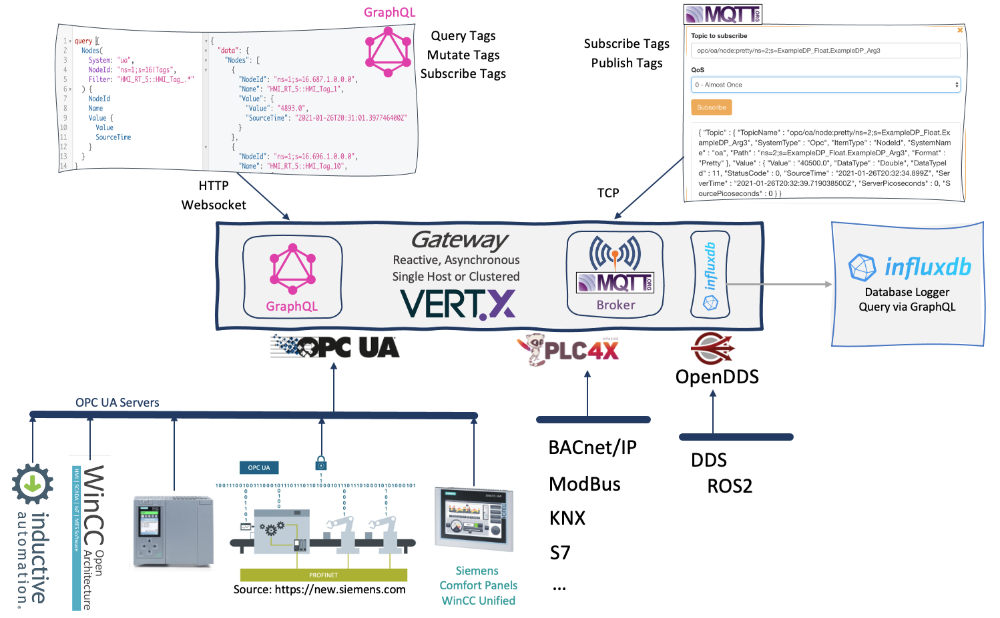

# Frankenstein Automation Gateway

Connect one or more OPC UA servers to the gateway and access the data from the OPC UA servers with a GraphQL or a MQTT client. News and Blog posts can be found [here](https://www.rocworks.at/wordpress/?cat=39)

You can sponsor this project [here](https://paypal.me/av75) :-)



# Version History
1.15 Nats Logger to write field values to a Nats server 
1.14 Fixes and optimizations  
1.13 MQTT Logger to write field values to a MQTT Broker  
1.12 MQTT Driver with Groovy script transformer (subscribe only)  
1.11 Apache Kafka Database Logger  
1.10 Apache IoTDB Database Logger  
1.9 Apache Ignite as Cluster option and Ignite as Memory-Store  
1.8 Upgrade to VertX 4.0.3  
1.7 DDS Driver (subscribe and publish)  
1.6 Added GraphiQL (http://localhost:4000/graphiql/)  
1.5 OPC UA Schemas to GraphQL Schema Importer  
1.4 Build GraphQL Schema from OPC UA Schemas   
1.3 OPC UA Browsing and fixes   
1.2 Simple Polling for PLC4X Driver    
1.1 PLC4X Driver    
1.0 Initial Version  

# Build and Run

It needs [JDK 11](https://openjdk.java.net/projects/jdk/11/) or higher.

You can open the project in IntelliJ IDEA IDE and build it there or use grade to build it from command line.

```
> cd source/app
> gradle build

> export GATEWAY_CONFIG=config.yaml
> gradle run
```

App is a single program with GraphQL, MQTT and the OPC UA connections in one single program. There is also an option to let it run in clustered mode. Then the modules (app-gateway, app-influxdb, app-plc4x, ...) run in separate processes and form a cluster with a distributed communication bus based on [Vert.x](https://vertx.io). With that option the modules can run on different nodes or they can be deployed in a Kubernetes Cluster. Also some options are only available in clustered mode (like plc4x), but if you want a single app with for example plc4x, then you can also include the plc4x parts in the single app, but you have to code it by your own. 

## Configuration

See config.yaml in the app directory for an example how to configure the Gateway. You can pass a configuration file name to the program as the first argument or by setting a environment variable GATEWAY_CONFIG. If no argument is given then config.yaml will be used. If there are any questions about the configuration, please get in touch with me. 

## Example Topics
Note: remove the blanks between the slashes! (just here for better readabilty)

Using the NodeId 
> opc / test / node / ns=2;s=ExampleDP_Float.ExampleDP_Arg1   
> opc / test / node / 2 / ExampleDP_Float.ExampleDP_Arg1   

Value as JSON with timestamp, quality, ...  
> opc / test / node:**json** / ns=2;s=ExampleDP_Float.ExampleDP_Arg1  
> opc / test / node:**json** / 2 / ExampleDP_Float.ExampleDP_Arg1  

Using the browse path instead of the NodeId  
> opc / test / **path** / *root-node-id* / *browse-name* / *browse-name* /...   

Wildcard "+" can also be used as a browsename
> opc / ua / **path**:json / *ns=1;s=16|Tags* / **+**  

"Objects" can be used as root node and will be replace with "i=85"
> opc / test / path / **Objects** / Test / Test00003 / float  
> opc / test / path / **Objects** / Test / Test00003 / +

Be careful when using wildcards when there are a lot of nodes, it can lead to a lot of browsing round trips  
> opc / test / path / Objects / Test / + / float

## Enable OPC UA Schema in GraphQL

The GraphQL server can read the OPC UA object schema and convert it to a GraphQL schema. The starting NodeIds can be set to reduce the amount of browsed items. Browsing can take some while if the OPC UA server holds a huge structure of tags!
```
GraphQLServer:
  Listeners:
    - Port: 4000
      Enabled: true
      LogLevel: INFO                    # ALL | INFO
      GraphiQL: true
      WriteSchemaToFile: false
      Schemas:                          # This systems will be browsed and converted to GraphQL
        - System: "unified"             # Id of OPC UA system, must correlate with the drivers id
          FieldName: BrowseName         # Use "BrowseName" or "DisplayName" as item name in GraphQL
          RootNodes: 
            - ns=2;s=Simulation         # Node will be browsed and added to GraphQL schema 
            - ns=2;s=SimulationMass     # Node will be browsed and added to GraphQL schema          
```

```
OpcUaClient:
  - Id: "unified" 
    Enabled: true
    LogLevel: INFO
    EndpointUrl: "opc.tcp://scada-server:4890"
    UpdateEndpointUrl: scada-server
    SecurityPolicyUri: http://opcfoundation.org/UA/SecurityPolicy#None  
```

Example GraphQL Query with two OPC UA systems:

```
{
  Systems {
    unified {
      HmiRuntime {
        HMI_RT_5 {
          Structure_instances{
            A1 {
              Velocity { ...Value }
              RefPoint { ...Value }
            }
          }
        }
      }
    }    
    ignition {
      Tag_Providers {
        default {
          Pump_1 {
            flow { ...Value }
            speed { ...Value }
          }
        }
      }
    }
  }
}

fragment Value on Node {
  Value {
    Value
    SourceTime
  }
}

```

## Build Docker Image

You have to build the program before with gradle. Then you can use the shell script `docker/build.sh` to build a docker image.  
`docker run --rm --name gateway -p 4000:4000 -p 1883:1883 -v $PWD/config.yaml:/app/config.yaml gateway`

> C:\Workspace\automation-gateway\source> gradle build  
> C:\Workspace\automation-gateway\docker> build.bat  
> C:\Workspace\automation-gateway\docker\examples\hazelcast> docker compose up -d  

## Using PLC4X

You have to start the app-gateway plus app-plc4x. See config.yaml in each folder of the app. Because some PLC4X drivers  /  plc's do not support subscriptions we have added a simple polling options. (currently only one polling time per connection). 

```
> cd app-gateway
> gradle run  

> cd app-plc4x
cat config.yaml
Plc4x:
  Drivers:    
    - Id: "mod"
      Enabled: true
      Url: "modbus://localhost:502"
      Polling:
        Time: 100  # ms
        OldNew: true  # old new comparions on or off
      LogLevel: ALL

> gradle run
```

Example GraphQL Query:
```
{
  a: NodeValue(
    Type: Plc,
    System: "mod"
    NodeId: "coil:1"
  ) {
    Value
  }
  b: NodeValue(
    Type: Plc
    System: "mod"
    NodeId: "holding-register:1:INT"
  ) {
    Value
    SourceTime
  }  
}
```

Example MQTT Topic:
> plc/mod/node:json/holding-register:1:INT  
> plc/mod/node/holding-register:2:INT  
> plc/mod/node:json/coil:1  
> plc/mod/node/coil:1  

# Version History

## 1.15 Nats Logger to write field values to a Nats server
Added a [Nats](https://nats.io) Logger to write field values to a Nats server. It is like a database logger, but it writes the values to a configurable Nats server. Any values which get into Frankenstein (OPC UA, PLC4X, DDS, MQTT) by a Driver can be logged to a Nats server. The values are stored in JSON format.
```
Database:
  Logger:
    - Id: nats1
      Type: Nats
      Enabled: true
      Url: "nats://nuc1:4222"
      WriteParameters:
        QueueSize: 20000
        BlockSize: 10000
      Logging:
        - Topic: opc/opc1/path/Objects/Demo/SimulationMass/SimulationMass_SByte/+
        - Topic: opc/opc1/path/Objects/Demo/SimulationMass/SimulationMass_Byte/+
````

## 1.14 Fixes and optimizations
* MQTT Driver: Caching of NodeIds in MQTT Driver (topic to NodeId cache).  
* MQTT Server and Driver:  max message size can be set in config file (e.g. for Video streaming).
* GraphQL Define one or more starting/root NodeIds for GraphQL OPC UA schema import.
* GraphQL: Renamed "NodeIds" to "RootNodes" in Schema section (for OCP UA )
* Renamed TopicValueDDS to TopicValueJson. 


## 1.13 MQTT Logger to write field values to a MQTT Broker
Added a **MQTT Logger** to write field values to a MQTT Broker. It is like a database logger, but it writes the values to a configurable MQTT Broker. Any values which get into Frankenstein (OPC UA, PLC4X, DDS, MQTT) by a Driver can be logged to a MQTT Broker. The values are stored in JSON format.

```
Database:
  Logger:
    - Id: mqtt1
      Type: Mqtt
      Enabled: true
      Host: 192.168.1.169
      Port: 1883
      Ssl: false
      WriteParameters:
        QueueSize: 20000
        BlockSize: 10000
      Logging:
        - Topic: opc/smarthome/path/Meter_Input/WattAct
        - Topic: opc/smarthome/path/Meter_Output/WattAct
        - Topic: opc/smarthome/path/PV/Spot/+
```

## 1.12 MQTT Driver with Groovy script transformer (subscribe only)
Added a inital version of a **MQTT Driver** to get values from a MQTT Broker into Frankenstein. A Groovy script can be used to transform the values to an OPC UA format, so that Frankenstein can be used to log those value to databases. Functionality is currently very limited, only subscribe is implemented.

In this example we transform values of a MQTT Broker from this format: {"TimeMS":1620327963328,"Value":10.277357833719135} to our internal TopicValueOpc format by using a Groovy script and then log some topic values to an InfluxDB.

```
MqttClient:
  - Id: "mqtt1"
    Enabled: true
    LogLevel: INFO
    Host: 192.168.1.6
    Port: 1883
    Ssl: false
    Value:
      Format: JSON
      Script: >
        return [ 
          className: "TopicValueOpc",
          sourceTime: Instant.ofEpochMilli(source.TimeMS).toString(),
          serverTime: Instant.now().toString(),
          value: source.Value,
          dataTypeId: 0,
          statusCode: 0 ]

Database:
  Logger:
    - Id: influx1
      Type: InfluxDB
      Enabled: true
      Url: http://192.168.1.13:8086
      Database: test
      Username: ""
      Password: ""
      WriteParameters:
        QueueSize: 20000
        BlockSize: 10000
      Logging:
        - Topic: mqtt/mqtt1/path/Meter_Input/WattAct
        - Topic: mqtt/mqtt1/path/Meter_Output/WattAct
        - Topic: mqtt/mqtt1/path/PV/Spot/+          
```

## 1.11 Apache Kafka Database Logger
Added **Apache Kafka** as tag logger option, all incoming value changes of the configured topics will be published to an Apache Kafka Broker. How to can be found [here](https://www.rocworks.at/wordpress/?p=1076)
```
Database:
  Logger:
    - Id: kafka1
      Type: Kafka
      Servers: server2:9092
      WriteParameters:
        QueueSize: 20000
        BlockSize: 10000
      Logging:
        - Topic: opc/opc1/path/Objects/Demo/SimulationMass/SimulationMass_SByte/+
        - Topic: opc/opc1/path/Objects/Demo/SimulationMass/SimulationMass_Byte/+
```

You can also use KSQL to analyze the tag stream.
Connect to a ksql cli:
```
docker exec -ti ksqldb-cli ksql http://ksqldb-server:8088
```

Create a stream for your logger. Each logger has its own Kafka-Topic. Topic name is equal to the source id of the tag (opc/**opc1**/...)
```
CREATE STREAM opc1(
  browsePath VARCHAR KEY, 
  sourceTime VARCHAR, 
  value DOUBLE, 
  statusCode VARCHAR
) WITH (
  KEY_FORMAT='KAFKA',
  KAFKA_TOPIC='opc1', 
  VALUE_FORMAT='JSON',
  TIMESTAMP='sourceTime',TIMESTAMP_FORMAT='yyyy-MM-dd''T''HH:mm:ss[.n]X'
);
```

Example of a simple quey:
```
SELECT node, COUNT(*) 
FROM opc1 
WINDOW SESSION (10 SECONDS) 
WHERE node like '%_00' 
GROUP BY node 
EMIT CHANGES;
```

## 1.10 Apache IoTDB Database Logger
Added **Apache IoTDB** as tag logger option.
```
Database:
  Logger:
   - Id: iotdb1
      Type: IoTDB
      Host: server2
      Port: 6667
      Database: root.scada1
      Username: "root"
      Password: "root"
      WriteParameters:
        QueueSize: 20000
        BlockSize: 10000
      Logging:
        - Topic: opc/opc1/path/Objects/Demo/SimulationMass/SimulationMass_SByte/+
        - Topic: opc/opc1/path/Objects/Demo/SimulationMass/SimulationMass_Byte/+
```

## 1.9 Apache Ignite as Cluster option and Ignite as Memory-Store
Added **Apache Ignite** as an option for clustering and also to use the Apache Ignite Distributed In Memory **Cache** for storing last and history values coming from OPC UA or other sources. With that enabled it is possible to do **SQL** queries on the process values. The cache node stores historical value changes for a defined timerange. So older values are purged on a regular basis (configurable in the configuration file). It is configurable which topics should be stored in the Apache Ignite Cache.

```
Cache:
  - Id: "global"
    Enabled: true
    LogLevel: INFO
    SqlIndexMaxInlineSize: 1000
    StoreHistoryValues: true
    Systems:
      - SystemType: Opc
        SystemName: "opcua1"
        PurgeEverySeconds: 10
        KeepLastSeconds: 180
      - SystemType: Opc
        SystemName: "opcua2"
        PurgeEverySeconds: 10        
        KeepLastSeconds: 180                                    
    Logging:
      - Topic: opc/opcua1/path/Objects/Demo/SimulationMass/SimulationMass_Double/+
      - Topic: opc/opcua2/path/Objects/Demo/SimulationMass/SimulationMass_Double/+
```

Updates on the tables are currently not possible. It is implemented that updates on the updatevalue columns should write the values to the source OPC UA server, but unfortunately it leads to unexpected behaviour of the Ignite Cluster.  

There is a command line query tool available in the Apache Ignite Distribution. But you can also download the JDBC driver or ODBC drive from the Apache Ignite Website and use any other JDBC/ODBC client tool.
> C:\Tools\apache-ignite-2.9.1-bin\bin\sqlline.bat -u jdbc:ignite:thin://192.168.1.18

Example Queries:
```
select * from global.opcnode where nodeid like '%Mass%'  

select systemname, count(*) 
from global.opcvalue
 group by systemname;   

select systemname, count(*), min(sourcetime), max(sourcetime) 
from global.opcvaluehistory 
group by systemname;  
```

There are Docker examples available in the docker/examples directory.  
> C:\Workspace\automation-gateway\source> gradle build  
> C:\Workspace\automation-gateway\docker> build.bat  
> C:\Workspace\automation-gateway\docker\examples\ignite> docker compose up -d  

## 1.8 Upgrade to VertX 4.0.3
Upgraded to VertX 4.0.3 and splitted the value type to a base class with subclasses for Opc, Plc and DDS. The app names have been changed, the clustered apps are now named with "cluster". DDS values can now be logged to InfluxDB.  

## 1.7 DDS Driver (subscribe and publish)
Added a first version of DDS support. Currently only MQTT subscribe and publish to DDS topics are functional. It is the app-dds application, the app-gateway must also be up and running.

You need to install OpenDDS and build it with Java support. And you also have to compile your DDS IDL files with Java support. See the ReadMe.txt in the idl directory of app-dds.

Example MQTT Topic: 
> dds/system-id/path/topic-type-name/topic-name  
> dds/demo/path/shape/Circle  
> dds/demo/path/shape/Square  

Configuration
```
DDS:
  Domains:
    - Id: "demo"
      Enabled: true
      LogLevel: ALL
      DCPSConfigFile: rtps.ini
      Domain: 0
      TopicTypes:
        - Id: "shape"
          TopicTypeName: "org.omg.dds.demo.ShapeType"
        - Id: "message"
          TopicTypeName: "org.omg.dds.demo.Message"
```

## 1.6 Added GraphiQL (http://localhost:4000/graphiql/)
Added GraphiQL to the Gateway and optionally write the browsed schemas (OPC UA and generated GraphQL scheam) to files.
```
GraphQLServer:
  Listeners:
    - Port: 4000
      LogLevel: ALL
      GraphiQL: true  # Enable GraphiQL
      WriteSchemaToFile: false  # Write GraphQL Schema to a file
      Schemas:
        - System: ignition
          FieldName: BrowseName # BrowseName | DisplayName
OpcUaClient:
  - Id: "ignition"
    Enabled: true
    BrowseOnStartup: true           
```

## 1.5 OPC UA Schemas to GraphQL Schema Importer
Support multiple OPC UA schemas in GraphQL. Be sure that you have set `BrowseOnStartup: true` for the OPC UA servers which you want to embed in the GraphQL schema. Additionally it can be defined which OPC UA field should be taken as the GraphQL field name: it can be "BrowseName" or "DisplayName". But be careful, the DisplayName must not be unique below a node, so it can lead to an invalid schema. 
```
GraphQLServer:
  Listeners:
    - Port: 4000
      LogLevel: ALL
      Schemas:
        - System: ignition
          FieldName: BrowseName # BrowseName | DisplayName
OpcUaClient:
  - Id: "ignition"
    Enabled: true
    BrowseOnStartup: false 
```
