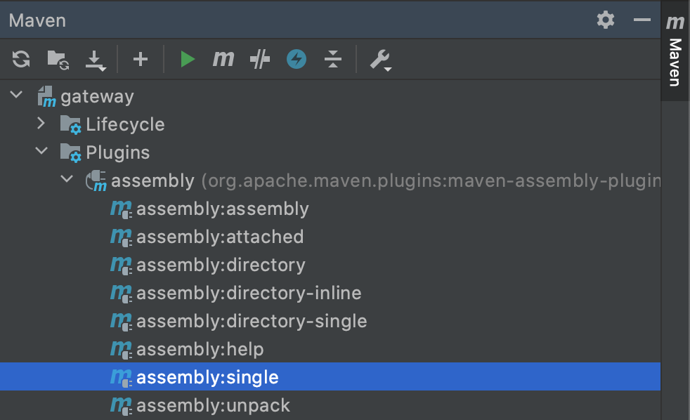

# OPC UA Gateway for GraphQL and MQTT

Connect one or more OPC UA servers to the gateway and access the data from the OPC UA servers with a GraphQL or a MQTT client.


# Build and Run

It needs [JDK 11](https://openjdk.java.net/projects/jdk/11/).

You can open the project in IntelliJ IDEA IDE and build it there.  
There is also a shell script `build.sh` to build it with [Maven](https://maven.apache.org/download.cgi).  


```
> sh build.sh
> sh run.sh
```

## Configuration

See config-example.yaml for an example how to configure the Gateway. You can pass a configuration file name to the program as the first argument. If no argument is given then config.yaml will be used.

A more detailed description of the configuration file will come...


## Single JAR with Dependencies

A single JAR with all dependencies can be build with IntelliJ.


## Build Docker Image

You have to build the program before with maven.  
You can use the shell script `docker-build.sh` to build a docker image.  
`docker run --rm -v $PWD/config-docker.yaml:/app/config.yaml gateway`
