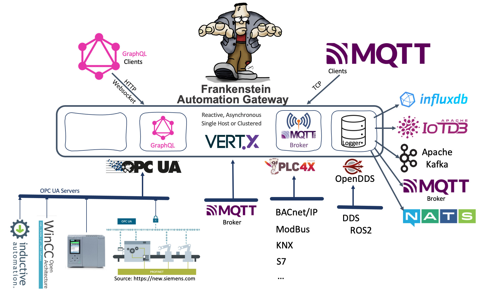

# Frankenstein Automation Gateway

Connect one or more OPC UA servers to the gateway and access the data from the OPC UA servers with a GraphQL or a MQTT client and store it in a range of databases and platforms like InfluxDB, IoTDB, Kafka and more.

The Gateway passes values through, it does not store data internally. The MQTT Broker is not a fully MQTT Broker! It does not keep values in memory. If you subscribe to a virtual MQTT-Topic, which must follow certain rules, then it will connect to the tags in OPC UA or PLC4X and will pass the values to the client. If multiple clients subscribe to the same virtual topic, then only one subscription to the device is made and the Gateway will distribute the values to all the clients.  

The Gateway offers functionality to log value changes from OPC UA and PLC4X in a range of databases and platforms, including InfluxDB, IoTDB, Kafka, among others. Tested with up to 250000 value changes per second on comodity hardware!  

Docker images can be found on [Docker Hub](https://hub.docker.com/r/rocworks/automation-gateway).

News and Blog posts can be found [here](https://www.rocworks.at/wordpress/?cat=39).  



# Content

- [Build and Run](#build-and-run)
- [Configuration](#configuration)
- [OPC UA Client Configuration](#opc-ua-client-configuration)
- [OPC UA Schema in GraphQL](#enable-opc-ua-schema-in-graphql)
- [Topic Mapping](#topic-mapping)
- [Logger Configuration](#logger-configuration)
- [Build Docker Image](#build-docker-image)
- [Using PLC4X](#using-plc4x)
- [Version History](#version-history)

# Build and Run

It needs [Java 11](https://openjdk.java.net/projects/jdk/11/) or higher. There is an issue with Java 8 update 292 and bouncycastl encryption. [here](https://github.com/bcgit/bc-java/issues/941) you can find more information about this issue..

You can open the project in IntelliJ IDEA IDE and build it there or use grade to build it from command line. You can download [gradle 7](https://gradle.org/releases/) and build it from command line. Use **version 7** of gradle! Check the version of gradle if you install gradle on Linux with your package management system. On some distributions gradle is too old and will throw errors during build phase. 

```
> cd source/app
> gradle build

> export GATEWAY_CONFIG=config.yaml  # Set configuration file (default is config.yaml)
> gradle run
```
You can also pass the configuration filename as an argument.

App is with GraphQL, MQTT and the OPC UA connections.    
There is also "App-plc4x" which includes the [plc4x](https://plc4x.apache.org/) connectivity.  

## Configuration

See config.yaml in the app directory for an example how to configure the Gateway. You can pass a configuration file name to the program as the first argument or by setting a environment variable GATEWAY_CONFIG. If no argument is given then config.yaml will be used. If there are any questions about the configuration, please get in touch with me. 

If you enable [GraphiQL](https://github.com/graphql/graphiql), a graphical ui to build and execute GraphQL queries, then you can access GraphiQL with  
> http://localhost:4000/graphiql/ **! trailing slash is important !**

```
MqttServer:
  Listeners:
    - Id: Mqtt
      Port: 1883
      Host: 0.0.0.0
      LogLevel: INFO # ALL | INFO
      
GraphQLServer:
  Listeners:
    - Port: 4000
      Enabled: true
      LogLevel: INFO
      GraphiQL: true
```

## OPC UA Client Configuration
See config directory for more example configurations.
```
  - Id: "unified"
    Enabled: false
    LogLevel: INFO
    EndpointUrl:  "opc.tcp://desktop-9o6hthf:4890"
    SecurityPolicyUri: http://opcfoundation.org/UA/SecurityPolicy#Basic128Rsa15
    SubscriptionSamplingInterval: 0
    UsernameProvider:
      Username: opcuauser
      Password: password1
    WriteParameters:
      QueueSize: 1000
      BlockSize: 100
      WithTime: true
    MonitoringParameters:
      BufferSize: 10
      SamplingInterval: 0.0
      DiscardOldest: true
```

## OPC UA Schema in GraphQL

The GraphQL server can read the OPC UA object schema and convert it to a GraphQL schema. The starting NodeIds can be set to reduce the amount of browsed items. Browsing can take some while if the OPC UA server holds a huge structure of tags!
```
GraphQLServer:
  Listeners:
    - Port: 4000
      Enabled: true
      LogLevel: INFO                    # ALL | INFO
      GraphiQL: true
      WriteSchemaToFile: false
      Schemas:                          # This systems will be browsed and converted to GraphQL
        - System: "unified"             # Id of OPC UA system, must correlate with the drivers id
          FieldName: BrowseName         # Use "BrowseName" or "DisplayName" as item name in GraphQL
          RootNodes: 
            - ns=2;s=Simulation         # Node will be browsed and added to GraphQL schema 
            - ns=2;s=SimulationMass     # Node will be browsed and added to GraphQL schema          
```

```
OpcUaClient:
  - Id: "unified" 
    Enabled: true
    LogLevel: INFO
    EndpointUrl: "opc.tcp://scada-server:4890"
    UpdateEndpointUrl: scada-server
    SecurityPolicyUri: http://opcfoundation.org/UA/SecurityPolicy#None  
```

Example GraphQL Query with two OPC UA systems:

```
{
  Systems {
    unified {
      HmiRuntime {
        HMI_RT_5 {
          Structure_instances{
            A1 {
              Velocity { ...Value }
              RefPoint { ...Value }
            }
          }
        }
      }
    }    
    ignition {
      Tag_Providers {
        default {
          Pump_1 {
            flow { ...Value }
            speed { ...Value }
          }
        }
      }
    }
  }
}

fragment Value on Node {
  Value {
    Value
    SourceTime
  }
}

```

## Topic Mapping
With the built in MQTT Interface you can get access to the connected OPC UA servers by subscribing to MQTT Topics.  

The Topic name follows a certain rule. When a MQTT client subscribes to such MQTT topics, then the Gateway will create a subscription to the Node in the OPC UA Server. If multiple clients subscribe to the same Topic/Node, then the Gateway will act as a distributor and only one connection to the node is made.  

Note: In the following examples "test" is the Id of the OPC UA Client in the configuration file.

Note: Remove the blanks between the slashe! Just here for better readabilty. 

Using the NodeId 
> opc / test / node / ns=2;s=ExampleDP_Float.ExampleDP_Arg1   
> opc / test / node / 2 / ExampleDP_Float.ExampleDP_Arg1   

Value as JSON with timestamp, quality, ...  
> opc / test / node:**json** / ns=2;s=ExampleDP_Float.ExampleDP_Arg1  
> opc / test / node:**json** / 2 / ExampleDP_Float.ExampleDP_Arg1  

Using the browse path instead of the NodeId  
> opc / test / **path** / *root-node-id* / *browse-name* / *browse-name* /...   

Wildcard "+" can also be used as a browsename
> opc / ua / **path**:json / *ns=1;s=16|Tags* / **+**  

"Objects" can be used as root node and will be replace with "i=85"
> opc / test / path / **Objects** / Test / Test00003 / float  
> opc / test / path / **Objects** / Test / Test00003 / +

Be careful when using wildcards when there are a lot of nodes, it can lead to a lot of browsing round trips  
> opc / test / path / Objects / Test / + / float

## Logger Configuration
Loggers for different type of sinks can be defined in the configuration file. All of them share a common configuration and can have additonal sink specific configuration. Sink specific configuration can be found in the example configuration files or in the version history.

In the "Logging" section we can specify the Topics which should be logged to the sink. The Topics follow the same rule as MQTT Topics and will map to sources like OPC UA or PLC4X. See [Topic Mapping](#topic-mapping).
```
Database:
  Logger:
    - Id: influx1
      Type: InfluxDB
      Enabled: true
      Url: http://192.168.1.13:8086
      Database: test
      Username: ""
      Password: ""
      WriteParameters:
        QueueSize: 20000
        BlockSize: 10000
      Logging:
        - Topic: opc/opc1/path/Objects/Demo/SimulationMass/SimulationMass_SByte/+
        - Topic: opc/opc1/path/Objects/Demo/SimulationMass/SimulationMass_Byte/+
  
```

Every logger has an internal topic where the throughput is updated every second.
Topic: logger/**logger-id**/metrics
Value: {"Input v/s":20932,"Output v/s":20932}  # just an example

## Build Docker Image

You have to build the program before with gradle. Then you can use the shell script `docker/build.sh` to build a docker image.  
`docker run --rm --name gateway -p 4000:4000 -p 1883:1883 -v $PWD/config.yaml:/app/config.yaml gateway`

> C:\Workspace\automation-gateway\source> gradle build  
> C:\Workspace\automation-gateway\docker> build.bat  
> C:\Workspace\automation-gateway\docker\examples\hazelcast> docker compose up -d  

## Using PLC4X

You the application app-plc4x to get values from various source supported by PLC4X. See config.yaml in each folder of the app. Because some PLC4X drivers/plc's do not support subscriptions we have added a simple polling options (currently only one polling time per connection). 

```
> cd app-plc4x
cat config.yaml
Plc4x:
  Drivers:
    - Id: "machine1"
      Enabled: true
      Url: "modbus://127.0.0.1:502"
      Polling:
        Time: 1000 # ms
        Timeout: 900 # ms
        OldNew: true
      WriteTimeout: 100 # ms
      ReadTimeout: 100 # ms
      LogLevel: ALL

> gradle run
```

Example GraphQL Query:
```
{
  a: NodeValue(
    Type: Plc,
    System: "mod"
    NodeId: "coil:1"
  ) {
    Value
  }
  b: NodeValue(
    Type: Plc
    System: "mod"
    NodeId: "holding-register:1:INT"
  ) {
    Value
    SourceTime
  }  
}
```

Example MQTT Topic:
> plc/mod/node:json/holding-register:1:INT  
> plc/mod/node/holding-register:2:INT  
> plc/mod/node:json/coil:1  
> plc/mod/node/coil:1  

# Version History
- [1.20.2 Modifed JSON Format of Kafka Logger](#1202-modifed-json-format-of-kafka-logger)
- [1.20.1 Kafka properties in the config file](#1201-kafka-properties-in-the-config-file)  
- [1.20 Cleanup and GraalVM Native Build](#120-cleanup-and-graalvm-native-build)  
- [1.19 Neo4j Logger](#119-neo4j-logger)  
- [1.18.3 Added MQTT Websocket Option and simple Authentication](#1183-added-mqtt-websocket-option-and-simple-authentication)  
- [1.18.2 Raw value to engineering value conversion for PLC4X driver](#1182-raw-value-to-engineering-value-conversion-for-plc4x-driver)  
- [1.18.1 Features and bug fixes in PLC4X driver](#1181-features-and-fixes-in-plc4x-driver)  
- [1.18 Removed Apache Ignite](#118-removed-apache-ignite)  
- [1.17 Added CrateDB as supported JDBC database for logging](#117-added-cratedb-as-supported-jdbc-database-for-logging)  
- [1.16 JDBC Logger to write field values to relational databases](#116-jdbc-logger-to-write-field-values-to-relational-databases)  
- [1.15 Nats Logger to write field values to a Nats server](#115-nats-logger-to-write-field-values-to-a-nats-server)  
- [1.14 Fixes and optimizations](#114-fixes-and-optimizations)  
- [1.13 MQTT Logger to write field values to a MQTT Broker](#113-mqtt-logger-to-write-field-values-to-a-mqtt-broker)  
- [1.12 MQTT Driver with Groovy script transformer](#112-mqtt-driver-with-groovy-script-transformer)
- [1.11 Apache Kafka Database Logger](#111-apache-kafka-database-logger)  
- [1.10 Apache IoTDB Database Logger](#110-apache-iotdb-database-logger)  
- [1.9 Apache Ignite as Cluster option and Ignite as Memory-Store](#19-apache-ignite-as-cluster-option-and-ignite-as-memory-store)  
- [1.8 Upgrade to VertX 4.0.3](#18-upgrade-to-vertx-403)  
- [1.7 DDS Driver (subscribe and publish)](#17-dds-driver-subscribe-and-publish)  
- [1.6 Added GraphiQL](#16-added-graphiql-httplocalhost4000graphiql)  
- [1.5 OPC UA Schemas to GraphQL Schema Importer](#15-opc-ua-schemas-to-graphql-schema-importer)  
- 1.4 Build GraphQL Schema from OPC UA Schemas   
- 1.3 OPC UA Browsing and fixes   
- 1.2 Simple Polling for PLC4X Driver    
- 1.1 PLC4X Driver    
- 1.0 Initial Version  
## 1.20.2 Modifed JSON Format of Kafka Logger
Added times in ms epoch and also added the value as double and as string. 
```
{
	"nodeId": "ns=2;i=3",
	"systemName": "scadaopcua",
	"topicName": "opc/scadaopcua/path/Objects/Home/#",
	"browsePath": "Objects/Home/Gas/Daily",
	"sourceTime": "2023-07-14T09:53:43.945894Z",
	"serverTime": "1601-01-01T00:00:00Z",
	"sourceTimeMs": 1689328423945,
	"serverTimeMs": -11644473600000,
	"value": 2,
	"valueAsString": "2",
	"valueAsDouble": 2,
	"statusCode": "0"
}
```
## 1.20.1 Kafka properties in the config file
It can be configured with a bunch of properties as described in the official [Apache Kafka documentation](https://kafka.apache.org/documentation/#producerconfigs).  

Put the properites and values below "Configs" - see example below where the "batch.size" is set to 10000.  

But be careful, you will not get an error message if you set an unknow property, so be sure to use right name of the property.
```
Database:
  Logger:
    - Id: kafka1
      Type: Kafka
      Enabled: true
      Servers: nuc1.rocworks.local:9092
      Configs:  # you can set any valid Kafka producer property here
        batch.size: 10000
      WriteParameters:
        QueueSize: 20000
        BlockSize: 10000
      Logging:
        - Topic: opc/opc1/path/Objects/Demo/SimulationMass/SimulationMass_SByte/+
        - Topic: opc/opc1/path/Objects/Demo/SimulationMass/SimulationMass_Byte/+
```
## 1.20 Cleanup and GraalVM Native Build
GraalVM Native Image build is now possible, see directory "native". Removed various unused features and upgraded libraries to the latest versions. For the native build it was needed to replace SLF4J logging with the standard Java logging.  

Removed Features:  
* Clustering  
* NATS  
* DDS
* IoTDB: it leads to debug(!) log messages of other components, did not invest time to find out how to get rid of this behaviour.  
* MQTTDriver: it uses Groovy and I could get it running natively compiled, so I had to remove it to get rid of Groovy  

Fixed bug: Topic data class now contains two separate fields "path" and "node". Before there was only one field "address". This also fixed a Bug when connecting/disconnecting of topics with wildcards.

## 1.19 Neo4j Logger  
Added Neo4j as an option to log values from OPC UA to the graph database. Additionally the OPC UA node structure can also be replicated to the graph database. This will be done only once at the startup of the Automation Gateway.  
```
Database:
  Logger:
    - Id: neo4j
      Enabled: true
      Type: Neo4j
      Url: bolt://nuc1.rocworks.local:7687
      Username: "neo4j"
      Password: "manager"
      Schemas:
        - System: opc1  # Replicate node structure to the graph database
          RootNodes:
            - "ns=2;s=Demo"  # This node and everything below this node
        - System: winccoa1  # Replicate the nodes starting from "i=85" (Objects) node
      WriteParameters:
        BlockSize: 1000
      Logging:
        - Topic: opc/opc1/path/Objects/Demo/SimulationMass/SimulationMass_Float/+
        - Topic: opc/opc1/path/Objects/Demo/SimulationMass/SimulationMass_Double/+
        - Topic: opc/opc1/path/Objects/Demo/SimulationMass/SimulationMass_Int16/+
        - Topic: opc/winccoa1/path/Objects/PUMP1/#
        - Topic: opc/winccoa1/path/Objects/ExampleDP_Int/#


```

## 1.18.3 Added MQTT Websocket Option and simple Authentication  
Added the option to enable a Websocket listener for the MQTT server.
The Websocket listener is listening on the endpoint "/mqtt".
Example MQTT Client Url: "ws://your-host-or-ip/mqtt"
```
MqttServer:
  Listeners:
    - Id: Mqtt  # Tcp listener without authentication
      Port: 1883

    - Id: MqttWs  # Websocket listener with authentication
      Port: 1884
      Websocket: true  
      Username: system  # If empty, then any username can be used
      Password: manager  # If empty, then any or no password can be used
```

## 1.18.2 Raw value to engineering value conversion for PLC4X driver
It is now possible to define Groovy functions to convert raw values to engineering values. Every incoming or outgoing value will be passed through the defined functions. The functions can currently only be defined at the connection level, so every value coming from this PLC connection goes through the conversion functions.  

```
Plc4x:
  Drivers:
    - Id: "niryo"
      Enabled: true
      Url: "modbus://192.168.1.9:5020"
      Polling:
        Time: 100
        Timeout: 90
        OldNew: true
      WriteTimeout: 100
      ReadTimeout: 100
      LogLevel: ALL
      Value:
        Reader: > # Here is the function for incoming values
          def x = value as int;
          return x > 32767 ? 32767 - x : x
        Writer: > # Here is the function for outgoing values
          def x = value as int;
          return x < 0 ? 32767 - x : x
```
If you need different functions for different addresses then you have to implement a switch/case statement. The functions have two arguments: "address" and "value". 

Here is an example where a value conversion is done only for some addresses:
```
      Value:
        Reader: >
          def x = value as int;
          def xs = ["input-register:1:UINT", "input-register:2:UINT", "input-register:2:UINT"];
          if (xs.contains(address)) {
            println "convert!"
            return x > 32767 ? 32767 - x : x;
          } else {
            println("default")
            return x;
          } 
```

## 1.18.1 Features and fixes in PLC4X driver  
Auto reconnect to the PLC if the connection is lost.  
Read/Write/Poll only if the connection to the PLC is up.  
Fixed issue when writing a value fails (stopped the writing thread).  
Fixed issue in unsubscribe with polling option (polling item was not removed).  
Fixed issue when a client disconnects (unsubscribe with a list of topics failed).  
Added new configuration settings for the driver: timeout in ms for write, read, polling.  
```
Plc4x:
  Drivers:
    - Id: "machine1"
      Enabled: true
      Url: "modbus://127.0.0.1:502"
      Polling:
        Time: 1000
        Timeout: 900 # ms
        OldNew: true
      WriteTimeout: 100 # ms
      ReadTimeout: 100 # ms
      LogLevel: INFO
````

## 1.18 Removed Apache Ignite
Apache Ignite was removed due to its size and maintenance requirements. We don't know of anyone using the Ignite option, so we decided to remove it.  

## 1.17 Added CrateDB as supported JDBC database for logging  
[CrateDB](https://crate.io) is now also supported as JDBC database for logging. If the table (default name "events") does not exists, it will be created partitioned by the month of the source time with four shareds. But you can create the table manually in advance with the settings of your needs.
```
CREATE TABLE IF NOT EXISTS $sqlTableName (
  "sys" TEXT, 
  "nodeid" TEXT,          
  "sourcetime" TIMESTAMP WITH TIME ZONE,
  "servertime" TIMESTAMP WITH TIME ZONE,
  "sourcetime_month" TIMESTAMP WITH TIME ZONE GENERATED ALWAYS AS date_trunc('month', "sourcetime"),
  "numericvalue" DOUBLE,
  "stringvalue" TEXT,
  "status" TEXT,
  PRIMARY KEY (sourcetime_month, sourcetime, sys, nodeid)
) CLUSTERED INTO 4 SHARDS PARTITIONED BY ("sourcetime_month");   
```


## 1.16 JDBC Logger to write field values to relational databases  
Added the option to log values to a JDBC compliant relational database. You have to add the JDBC driver to your classpath and set the appropriate JDBC URL path in the configuration file. PostgreSQL, MySQL and Microsoft SQL Server JDBC drivers are already included in the build.gradle file (see lib-jdbc/build.gradle) and also appropriate SQL statements are implemented for those relational databases. If you use other JDBC drivers you can add the driver to the lib-jdbc/build.gradle file as runtime only dependency and you may specify SQL statements for insert and select in the configuration file.

You can specify the table name in the config file with the option "SqlTableName", if you do not specify the table name then "events" will be used as default name.  


Specify JDBC drivers in the lib-jdbc/build.gradle file:  
```
    runtimeOnly group: 'org.postgresql', name: 'postgresql', version: '42.2.20'
    runtimeOnly group: 'mysql', name: 'mysql-connector-java', version: '8.0.25'
    runtimeOnly group: 'com.microsoft.sqlserver', name: 'mssql-jdbc', version: '9.2.1.jre11'
```

Create a table with this structure. For PostgreSQL, MySQL and Microsoft SQL Server the table will be created on startup automatically.  
```
  CREATE TABLE IF NOT EXISTS public.events
  (
      sys character varying(30) NOT NULL,
      nodeid character varying(30) NOT NULL,
      sourcetime timestamp without time zone NOT NULL,
      servertime timestamp without time zone NOT NULL,
      numericvalue numeric,
      stringvalue text,
      status character varying(30) ,
      CONSTRAINT pk_events PRIMARY KEY (system, nodeid, sourcetime)
  )
  TABLESPACE ts_scada;
```

Configuration of JDBC database logger:  
```
Database:
  Logger:
    - Id: postgres
      Type: Jdbc
      Enabled: true
      Url: jdbc:postgresql://nuc1:5432/scada
      Username: system
      Password: manager
      SqlTableName: events     
      WriteParameters:
        QueueSize: 20000
        BlockSize: 10000
      Logging:
        - Topic: opc/opc1/path/Objects/Demo/SimulationMass/SimulationMass_SByte/+
        - Topic: opc/opc1/path/Objects/Demo/SimulationMass/SimulationMass_Byte/+
```

Because the SQL dialect can be slightly different with other databases, you can specify the insert and select SQL statement in the config file:
```
Database:
  Logger:
    - Id: other
      Type: Jdbc
      Enabled: true
      Url: jdbc:other://nuc1:1111/scada
      Username: system
      Password: manager
      SqlTableName: events     
      SqlInsertStatement: > 
        INSERT INTO events (sys, nodeid, sourcetime, servertime, numericvalue, stringvalue, status)
         VALUES (?, ?, ?, ?, ?, ?, ?)
         ON CONFLICT ON CONSTRAINT PK_EVENTS DO NOTHING  
      SqlQueryStatement: >
        SELECT sourcetime, servertime, numericvalue, stringvalue, status
         FROM events
         WHERE sys = ? AND nodeid = ? AND sourcetime >= ? AND sourcetime <= ? 
```

## 1.15 Nats Logger to write field values to a Nats server
Added a [Nats](https://nats.io) Logger to write field values to a Nats server. It is like a database logger, but it writes the values to a configurable Nats server. Any values which get into Frankenstein (OPC UA, PLC4X, DDS, MQTT) by a Driver can be logged to a Nats server. The values are stored in JSON format.
```
Database:
  Logger:
    - Id: nats1
      Type: Nats
      Enabled: true
      Url: "nats://nuc1:4222"
      WriteParameters:
        QueueSize: 20000
        BlockSize: 10000
      Logging:
        - Topic: opc/opc1/path/Objects/Demo/SimulationMass/SimulationMass_SByte/+
        - Topic: opc/opc1/path/Objects/Demo/SimulationMass/SimulationMass_Byte/+
````

## 1.14 Fixes and optimizations
* MQTT Driver: Caching of NodeIds in MQTT Driver (topic to NodeId cache).  
* MQTT Server and Driver:  max message size can be set in config file (e.g. for Video streaming).
* GraphQL Define one or more starting/root NodeIds for GraphQL OPC UA schema import.
* GraphQL: Renamed "NodeIds" to "RootNodes" in Schema section (for OCP UA )
* Renamed TopicValueDDS to TopicValueJson. 


## 1.13 MQTT Logger to write field values to a MQTT Broker
Added a **MQTT Logger** to write field values to a MQTT Broker. It is like a database logger, but it writes the values to a configurable MQTT Broker. Any values which get into Frankenstein (OPC UA, PLC4X, DDS, MQTT) by a Driver can be logged to a MQTT Broker. The values are stored in JSON format.

```
Database:
  Logger:
    - Id: mqtt1
      Type: Mqtt
      Enabled: true
      Host: 192.168.1.169
      Port: 1883
      Ssl: false
      WriteParameters:
        QueueSize: 20000
        BlockSize: 10000
      Logging:
        - Topic: opc/smarthome/path/Meter_Input/WattAct
        - Topic: opc/smarthome/path/Meter_Output/WattAct
        - Topic: opc/smarthome/path/PV/Spot/+
```

## 1.12 MQTT Driver with Groovy script transformer
Added a inital version of a **MQTT Driver** to get values from a MQTT Broker into Frankenstein. A Groovy script can be used to transform the values to an OPC UA format, so that Frankenstein can be used to log those value to databases. Functionality is currently very limited, only subscribe is implemented.

In this example we transform values of a MQTT Broker from this format: {"TimeMS":1620327963328,"Value":10.277357833719135} to our internal TopicValueOpc format by using a Groovy script and then log some topic values to an InfluxDB.

```
MqttClient:
  - Id: "mqtt1"
    Enabled: true
    LogLevel: INFO
    Host: 192.168.1.6
    Port: 1883
    Ssl: false
    Value:
      Format: JSON
      Script: >
        return [ 
          className: "TopicValueOpc",
          sourceTime: Instant.ofEpochMilli(source.TimeMS).toString(),
          serverTime: Instant.now().toString(),
          value: source.Value,
          dataTypeId: 0,
          statusCode: 0 ]

Database:
  Logger:
    - Id: influx1
      Type: InfluxDB
      Enabled: true
      Url: http://192.168.1.13:8086
      Database: test
      Username: ""
      Password: ""
      WriteParameters:
        QueueSize: 20000
        BlockSize: 10000
      Logging:
        - Topic: mqtt/mqtt1/path/Meter_Input/WattAct
        - Topic: mqtt/mqtt1/path/Meter_Output/WattAct
        - Topic: mqtt/mqtt1/path/PV/Spot/+          
```

## 1.11 Apache Kafka Database Logger
Added **Apache Kafka** as tag logger option, all incoming value changes of the configured topics will be published to an Apache Kafka Broker. How to can be found [here](https://www.rocworks.at/wordpress/?p=1076)
```
Database:
  Logger:
    - Id: kafka1
      Type: Kafka
      Servers: server2:9092
      WriteParameters:
        QueueSize: 20000
        BlockSize: 10000
      Logging:
        - Topic: opc/opc1/path/Objects/Demo/SimulationMass/SimulationMass_SByte/+
        - Topic: opc/opc1/path/Objects/Demo/SimulationMass/SimulationMass_Byte/+
```

You can also use KSQL to analyze the tag stream.
Connect to a ksql cli:
```
docker exec -ti ksqldb-cli ksql http://ksqldb-server:8088
```

Create a stream for your logger. Each logger has its own Kafka-Topic. Topic name is equal to the source id of the tag (opc/**opc1**/...)
```
CREATE STREAM opc1(
  browsePath VARCHAR KEY, 
  sourceTime VARCHAR, 
  value DOUBLE, 
  statusCode VARCHAR
) WITH (
  KEY_FORMAT='KAFKA',
  KAFKA_TOPIC='opc1', 
  VALUE_FORMAT='JSON',
  TIMESTAMP='sourceTime',TIMESTAMP_FORMAT='yyyy-MM-dd''T''HH:mm:ss[.n]X'
);
```

Example of a simple quey:
```
SELECT node, COUNT(*) 
FROM opc1 
WINDOW SESSION (10 SECONDS) 
WHERE node like '%_00' 
GROUP BY node 
EMIT CHANGES;
```

## 1.10 Apache IoTDB Database Logger
Added **Apache IoTDB** as tag logger option.
```
Database:
  Logger:
   - Id: iotdb1
      Type: IoTDB
      Host: server2
      Port: 6667
      Database: root.scada1
      Username: "root"
      Password: "root"
      WriteParameters:
        QueueSize: 20000
        BlockSize: 10000
      Logging:
        - Topic: opc/opc1/path/Objects/Demo/SimulationMass/SimulationMass_SByte/+
        - Topic: opc/opc1/path/Objects/Demo/SimulationMass/SimulationMass_Byte/+
```

## 1.9 Apache Ignite as Cluster option and Ignite as Memory-Store
Added **Apache Ignite** as an option for clustering and also to use the Apache Ignite Distributed In Memory **Cache** for storing last and history values coming from OPC UA or other sources. With that enabled it is possible to do **SQL** queries on the process values. The cache node stores historical value changes for a defined timerange. So older values are purged on a regular basis (configurable in the configuration file). It is configurable which topics should be stored in the Apache Ignite Cache.

```
Cache:
  - Id: "global"
    Enabled: true
    LogLevel: INFO
    SqlIndexMaxInlineSize: 1000
    StoreHistoryValues: true
    Systems:
      - SystemType: Opc
        SystemName: "opcua1"
        PurgeEverySeconds: 10
        KeepLastSeconds: 180
      - SystemType: Opc
        SystemName: "opcua2"
        PurgeEverySeconds: 10        
        KeepLastSeconds: 180                                    
    Logging:
      - Topic: opc/opcua1/path/Objects/Demo/SimulationMass/SimulationMass_Double/+
      - Topic: opc/opcua2/path/Objects/Demo/SimulationMass/SimulationMass_Double/+
```

Updates on the tables are currently not possible. It is implemented that updates on the updatevalue columns should write the values to the source OPC UA server, but unfortunately it leads to unexpected behaviour of the Ignite Cluster.  

There is a command line query tool available in the Apache Ignite Distribution. But you can also download the JDBC driver or ODBC drive from the Apache Ignite Website and use any other JDBC/ODBC client tool.
> C:\Tools\apache-ignite-2.9.1-bin\bin\sqlline.bat -u jdbc:ignite:thin://192.168.1.18

Example Queries:
```
select * from global.opcnode where nodeid like '%Mass%'  

select systemname, count(*) 
from global.opcvalue
 group by systemname;   

select systemname, count(*), min(sourcetime), max(sourcetime) 
from global.opcvaluehistory 
group by systemname;  
```

There are Docker examples available in the docker/examples directory.  
> C:\Workspace\automation-gateway\source> gradle build  
> C:\Workspace\automation-gateway\docker> build.bat  
> C:\Workspace\automation-gateway\docker\examples\ignite> docker compose up -d  

## 1.8 Upgrade to VertX 4.0.3
Upgraded to VertX 4.0.3 and splitted the value type to a base class with subclasses for Opc, Plc and DDS. The app names have been changed, the clustered apps are now named with "cluster". DDS values can now be logged to InfluxDB.  

## 1.7 DDS Driver (subscribe and publish)
Added a first version of DDS support. Currently only MQTT subscribe and publish to DDS topics are functional. It is the app-dds application, the app-gateway must also be up and running.

You need to install OpenDDS and build it with Java support. And you also have to compile your DDS IDL files with Java support. See the ReadMe.txt in the idl directory of app-dds.

Example MQTT Topic: 
> dds/system-id/path/topic-type-name/topic-name  
> dds/demo/path/shape/Circle  
> dds/demo/path/shape/Square  

Configuration
```
DDS:
  Domains:
    - Id: "demo"
      Enabled: true
      LogLevel: ALL
      DCPSConfigFile: rtps.ini
      Domain: 0
      TopicTypes:
        - Id: "shape"
          TopicTypeName: "org.omg.dds.demo.ShapeType"
        - Id: "message"
          TopicTypeName: "org.omg.dds.demo.Message"
```

## 1.6 Added GraphiQL (http://localhost:4000/graphiql/)
Added GraphiQL to the Gateway and optionally write the browsed schemas (OPC UA and generated GraphQL scheam) to files.
```
GraphQLServer:
  Listeners:
    - Port: 4000
      LogLevel: ALL
      GraphiQL: true  # Enable GraphiQL
      WriteSchemaToFile: false  # Write GraphQL Schema to a file
      Schemas:
        - System: ignition
          FieldName: BrowseName # BrowseName | DisplayName
OpcUaClient:
  - Id: "ignition"
    Enabled: true
```

## 1.5 OPC UA Schemas to GraphQL Schema Importer
Support multiple OPC UA schemas in GraphQL. Be sure that you have set `BrowseOnStartup: true` for the OPC UA servers which you want to embed in the GraphQL schema. Additionally it can be defined which OPC UA field should be taken as the GraphQL field name: it can be "BrowseName" or "DisplayName". But be careful, the DisplayName must not be unique below a node, so it can lead to an invalid schema. 
```
GraphQLServer:
  Listeners:
    - Port: 4000
      LogLevel: ALL
      Schemas:
        - System: ignition
          FieldName: BrowseName # BrowseName | DisplayName
OpcUaClient:
  - Id: "ignition"
    Enabled: true
```
