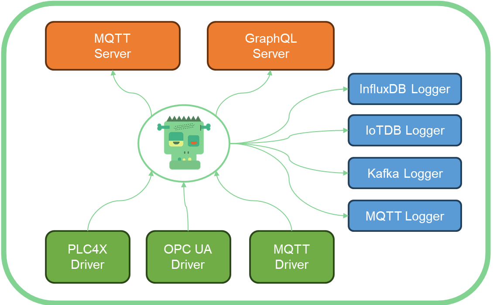

# Frankenstein Automation Gateway

Connect one or more OPC UA servers, PLC4X devices or MQTT brokers to the gateway and access the data with a GraphQL, a MQTT, or an OPC UA client. The Gateway additionally offers functionality to log value changes from OPC UA, MQTT and PLC4X in a range of databases and platforms, including QuestDB, InfluxDB, Kafka, among others. Tested with up to 250000 value changes per second on comodity hardware.  

Available logger sinks:  
* JDBC
  * PostgreSQL & TimescaleDB
  * QuestDB (PostgreSQL Driver, set SqlDbType to QuestDB, jdbc:postgresql://hostname:8812/qdb)
  * RisingWave (PostgreSQL Driver, set SqlDbType to RisingWave, jdbc:postgresql://hostname:4566/dev)
  * CrateDB 
  * MySQL
  * SQLServer
  * HSQL
* InfluxDB
* IoTDB
* Neo4J
* OpenSearch (ElasticSearch)
* Imply.io (Apache Druid)

* Kafka
* MQTT

The Gateway passes values through, it does not store data internally. The MQTT Broker is not a fully complient MQTT Broker. It does not keep values in memory. If you subscribe to a virtual MQTT-Topic, which must follow certain rules, then it will connect to the tags in OPC UA or PLC4X and will pass the values to the client. If multiple clients subscribe to the same virtual topic, then only one subscription to the device is made and the Gateway will distribute the values to all the clients.  

The Gateway also has an integrated OPC UA server. You can define what kind of data from MQTT brokers, other OPC UA servers and from PLC4X devices you want to have in the integraded OPC UA server. 

Docker images can be found on [Docker Hub](https://hub.docker.com/r/rocworks/automation-gateway).

News and Blog posts can be found [here](https://www.rocworks.at/wordpress/?cat=39).  

Here is a tutorial on [YouTube](https://youtu.be/1xL89R0NBsk?si=6rXNbYKleGygzCui).




# Content

- [Build and Run](#build-and-run)
- [Configuration](#configuration)
- [OPCUA Schema in GraphQL](#opcua-schema-in-graphql)
- [Topic Mapping](#topic-mapping)
- [Logger Configuration](#logger-configuration)
- [OPCUA Driver](#opcua-driver)
- [PLC4X Driver](#plc4x-driver)
- [MQTT Driver](#mqtt-driver)
- [Build Docker Image](#build-docker-image)
- [Version History](#version-history)

# Build and Run

It needs [Java 17](https://openjdk.java.net/projects/jdk/17/) or higher. There is an issue with Java 8 update 292 and bouncycastl encryption. [here](https://github.com/bcgit/bc-java/issues/941) you can find more information about this issue..

You can open the project in IntelliJ IDEA IDE and build it there or use grade to build it from command line. Use the included "gradlew" command. Tt will download and use the right gradle version.

```
> cd source/app
> ../gradlew build

> export GATEWAY_CONFIG=config.yaml  # Set configuration file (default is config.yaml)
> ../gradlew run
```

You can run the application using Gradle, or alternatively, you can use the ZIP file located in the `build/distributions` directory (either `app.zip` or `app.tar`). Extract the ZIP file, and you'll find the executable file at `app/bin/app` (or `app.bat` on Windows), which you can use to run the gateway. 

On Windows, you’ll need to modify the line that sets the CLASSPATH. Replace:
```bash
set CLASSPATH=...long list of libs...
```
with:
```bash
set CLASSPATH=%APP_HOME%\lib\*
```

This is because the full CLASSPATH, which includes all the libraries, is too long for Windows to handle. Otherwise, you'll encounter the error: "The input line is too long."

You can also pass the configuration filename as an argument.

App is with GraphQL, MQTT and the OPC UA connections.    
There is also "App-plc4x" which includes the [plc4x](https://plc4x.apache.org/) connectivity.  

## Configuration

See config.yaml in the app directory for an example how to configure the Gateway. You can pass a configuration file name to the program as the first argument or by setting a environment variable GATEWAY_CONFIG. If no argument is given then config.yaml will be used. 
* There is a YAML schema in the doc directory. This can be used with Visual Studio Code to create a valid YAML configuration for the gateway.

* In Visual Studio Codee install the "YAML Language Support by Red Hat" Extension. In the settings of this extension you will find the "schema" section, open the settings.json and add one line to the yaml.schemas sections: 
```"
yaml.schemas": {        
        "your-path-to-gateway/doc/yaml-json-schema.json": ["config*.yaml"]
}
```

If you enable [GraphiQL](https://github.com/graphql/graphiql), a graphical ui to build and execute GraphQL queries, then you can access GraphiQL with  
> http://localhost:4000/graphiql/ **! trailing slash is important !**

```yaml
Servers:
  Mqtt:
    - Id: Mqtt
      Port: 1883
      Host: 0.0.0.0
      LogLevel: INFO # ALL | INFO
      
  OpcUa:
    - Port: 4841
      LogLevel: INFO
      Topics:
        - Topic: opc/demo1/path/#
        - Topic: opc/demo2/path/#  

  GraphQL:
    - Id: GraphQL
      Port: 4000
      LogLevel: INFO
      GraphiQL: true
```

## OPCUA Schema in GraphQL

The GraphQL server can read the OPC UA object schema and convert it to a GraphQL schema. The starting NodeIds can be set to reduce the amount of browsed items. Browsing can take some while if the OPC UA server holds a huge structure of tags!
```yaml
Servers:
  GraphQL:
    - Id: GraphQL
      Port: 4000
      Enabled: true
      LogLevel: INFO                    # ALL | INFO
      GraphiQL: true
      WriteSchemaToFile: false
      Schemas:                          # This systems will be browsed and converted to GraphQL
        - System: "unified"             # Id of OPC UA system, must correlate with the drivers id
          FieldName: BrowseName         # Use "BrowseName" or "DisplayName" as item name in GraphQL
          RootNodes: 
            - ns=2;s=Simulation         # Node will be browsed and added to GraphQL schema 
            - ns=2;s=SimulationMass     # Node will be browsed and added to GraphQL schema          
```

```yaml
Drivers:
  OpcUa
  - Id: "unified" 
    Enabled: true
    LogLevel: INFO
    EndpointUrl: "opc.tcp://scada-server:4890"
    UpdateEndpointUrl: scada-server
    SecurityPolicyUri: http://opcfoundation.org/UA/SecurityPolicy#None  
```

Example GraphQL Query with two OPC UA systems:

```
{
  Systems {
    unified {
      HmiRuntime {
        HMI_RT_5 {
          Structure_instances{
            A1 {
              Velocity { ...Value }
              RefPoint { ...Value }
            }
          }
        }
      }
    }    
    ignition {
      Tag_Providers {
        default {
          Pump_1 {
            flow { ...Value }
            speed { ...Value }
          }
        }
      }
    }
  }
}

fragment Value on Node {
  Value {
    Value
    SourceTime
  }
}

```

## Topic Mapping
With the built in MQTT Interface you can get access to the connected OPC UA servers by subscribing to MQTT Topics.  

The Topic name follows a certain rule. When a MQTT client subscribes to such MQTT topics, then the Gateway will create a subscription to the Node in the OPC UA Server. If multiple clients subscribe to the same Topic/Node, then the Gateway will act as a distributor and only one connection to the node is made.  

Note: In the following examples "test" is the Id of the OPC UA Client in the configuration file.

Note: Remove the blanks between the slashe! Just here for better readabilty. 

Using the NodeId 
> opc / test / node / ns=2;s=ExampleDP_Float.ExampleDP_Arg1   
> opc / test / node / 2 / ExampleDP_Float.ExampleDP_Arg1   

Value as JSON with timestamp, quality, ...  
> opc / test / node:**json** / ns=2;s=ExampleDP_Float.ExampleDP_Arg1  
> opc / test / node:**json** / 2 / ExampleDP_Float.ExampleDP_Arg1  

Using the browse path instead of the NodeId  
> opc / test / **path** / *root-node-id* / *browse-name* / *browse-name* /...   

Wildcard "+" can also be used as a browsename
> opc / ua / **path**:json / *ns=1;s=16|Tags* / **+**  

"Objects" can be used as root node and will be replace with "i=85"
> opc / test / path / **Objects** / Test / Test00003 / float  
> opc / test / path / **Objects** / Test / Test00003 / +

Be careful when using wildcards when there are a lot of nodes, it can lead to a lot of browsing round trips  
> opc / test / path / Objects / Test / + / float

## Logger Configuration
Loggers for different type of sinks can be defined in the configuration file. All of them share a common configuration and can have additonal sink specific configuration. Sink specific configuration can be found in the example configuration files or in the version history.

In the "Logging" section we can specify the Topics which should be logged to the sink. The Topics follow the same rule as MQTT Topics and will map to sources like OPC UA or PLC4X. See [Topic Mapping](#topic-mapping).
```yaml
Loggers:
  InfluxDB:
    - Id: influx1
      Enabled: true
      Url: http://192.168.1.13:8086
      Database: test
      Username: ""
      Password: ""
      WriteParameters:
        QueueSize: 20000
        BlockSize: 10000
      Logging:
        - Topic: opc/opc1/path/Objects/Demo/SimulationMass/SimulationMass_SByte/+
        - Topic: opc/opc1/path/Objects/Demo/SimulationMass/SimulationMass_Byte/+
  
```

Every logger has an internal topic where the throughput is updated every second.
Topic: logger/**logger-id**/metrics
Value: {"Input v/s":20932,"Output v/s":20932}  # just an example

## OPCUA Driver
See config directory for more example configurations.
```yaml
Drivers:
  OpcUa:
  - Id: "unified"
    Enabled: true
    LogLevel: INFO
    EndpointUrl:  "opc.tcp://desktop-9o6hthf:4890"
    SecurityPolicy: Basic128Rsa15
    SubscriptionSamplingInterval: 0
    UsernameProvider:
      Username: opcuauser
      Password: password1
    WriteParameters:
      QueueSize: 1000
      BlockSize: 100
      WithTime: true
    MonitoringParameters:
      BufferSize: 10
      SamplingInterval: 0.0
      DiscardOldest: true
```

## PLC4X Driver

You the application app-plc4x to get values from various source supported by PLC4X. See config.yaml in each folder of the app. Because some PLC4X drivers/plc's do not support subscriptions we have added a simple polling options (currently only one polling time per connection). 

> cd app-plc4x  
> cat config.yaml

```yaml
Drivers:
  Plc4x:
  - Id: "machine1"
    Enabled: true
    Url: "modbus://127.0.0.1:502"
    Polling:
      Time: 1000 # ms
      Timeout: 900 # ms
      OldNew: true
    WriteTimeout: 100 # ms
    ReadTimeout: 100 # ms
    LogLevel: ALL
```
> gradle run


Example GraphQL Query:
```
{
  a: NodeValue(
    Type: Plc,
    System: "mod"
    NodeId: "coil:1"
  ) {
    Value
  }
  b: NodeValue(
    Type: Plc
    System: "mod"
    NodeId: "holding-register:1:INT"
  ) {
    Value
    SourceTime
  }  
}
```

Example MQTT Topic:
> plc/mod/node:json/holding-register:1:INT  
> plc/mod/node/holding-register:2:INT  
> plc/mod/node:json/coil:1  
> plc/mod/node/coil:1  

## MQTT Driver

MQTT Brokers can be connected with MQTT Driver. Withte the RAW Format the values are strings. JSON Format will be the Gateway's JSON format. If you add "CustomJson" to the config, then the JSON format can be customized. You can set JSON-Paths (without $.) to get the value out of a JSON. Currently only JSON objects are supported (not arrays).
```yaml
Drivers:  
  Mqtt:
    - Id: "mqtt1"
      LogLevel: INFO
      Host: 192.168.1.3
      Port: 1883
      Format: Json
      CustomJson: 
          Value: "Value"
          TimestampMs: "TimeMS"    
          TimestampIso: "TimeISO"
```

## Build Docker Image

You have to build the program before with gradle. Then you can use the shell script `docker/build.sh` to build a docker image.  
`docker run --rm --name gateway -p 4000:4000 -p 1883:1883 -v $PWD/config.yaml:/app/config.yaml gateway`

> C:\Workspace\automation-gateway\source> gradle build  
> C:\Workspace\automation-gateway\docker> build.bat  
> C:\Workspace\automation-gateway\docker\examples\hazelcast> docker compose up -d  

# Version History
- [1.38 Added Cassandra as database for logging](#138-added-cassandra-as-database-for-logging)
- [1.37 Support for Imply.io & reactivated QuestDB](#137-support-for-implyio--reactivated-questdb)
- [1.36 Support for InfluxDB V2](#136-support-for-influxdb-v2)
- [1.35 Enhancements and Bug Fixes](#135-enhancements-and-bug-fixes)
- [1.34 Added Config Upload Page](#134-added-config-upload-page)
- [1.33 Rework of Logging](#133-rework-of-logging)
- [1.32 Zenoh Logger](#132-zenoh-logger)
- [1.31 QuestDB Logger](#131-questdb-logger)
- [1.30 OpenSearch Logger](#130-opensearch-logger)
- [1.29 Extended OPC UA Browsing](#129-extended-opc-ua-browsing)
- [1.28 Various changes and code rework](#128-various-changes-and-code-rework)
- [1.27 Add target option to MQTT Logger for UNS](#127-add-target-option-to-mqtt-logger-for-uns)
- [1.26 Reactivated Neo4j Logger](#126-reactivated-neo4j-logger)
- [1.25 MQTT Driver Custom JSON Format](#125-mqtt-driver-custom-json-format)
- [1.24 Added OPC UA server](#124-added-opc-ua-server)
- [1.23 Upgrade to VertX 4.4.6](#123-upgrade-to-vertx-446)
- [1.22 Config file changes](#122-config-file-changes)
- [1.21.2 Fixes and SparkplugB for Kafka \& MQTT Logger](#1212-fixes-and-sparkplugb-for-kafka--mqtt-logger)
- [1.21.1 Fixes and SparkplugB for MQTT Client](#1211-fixes-and-sparkplugb-for-mqtt-client)
- [1.21 IoTDB, MQTT SparkplugB Logger, YAML Schema, Native-Image](#121-iotdb-mqtt-sparkplugb-logger-yaml-schema-native-image)
- [1.20.3 Moved Neo4J to separate branches](#1203-moved-neo4j-to-separate-branches)
- [1.20.2 Modifed JSON Format of Kafka Logger](#1202-modifed-json-format-of-kafka-logger)
- [1.20.1 Kafka properties in the config file](#1201-kafka-properties-in-the-config-file)
- [1.20 Cleanup and GraalVM Native Build](#120-cleanup-and-graalvm-native-build)
- [1.19 Neo4j Logger](#119-neo4j-logger)
- [1.18.3 Added MQTT Websocket Option and simple Authentication](#1183-added-mqtt-websocket-option-and-simple-authentication)
- [1.18.2 Raw value to engineering value conversion for PLC4X driver](#1182-raw-value-to-engineering-value-conversion-for-plc4x-driver)
- [1.18.1 Features and fixes in PLC4X driver](#1181-features-and-fixes-in-plc4x-driver)
- [1.18 Removed Apache Ignite](#118-removed-apache-ignite)
- [1.17 Added CrateDB as supported JDBC database for logging](#117-added-cratedb-as-supported-jdbc-database-for-logging)
- [1.16 JDBC Logger to write field values to relational databases](#116-jdbc-logger-to-write-field-values-to-relational-databases)
- [1.15 Nats Logger to write field values to a Nats server](#115-nats-logger-to-write-field-values-to-a-nats-server)
- [1.14 Fixes and optimizations](#114-fixes-and-optimizations)
- [1.13 MQTT Logger to write field values to a MQTT Broker](#113-mqtt-logger-to-write-field-values-to-a-mqtt-broker)
- [1.12 MQTT Driver with Groovy script transformer](#112-mqtt-driver-with-groovy-script-transformer)
- [1.11 Apache Kafka Database Logger](#111-apache-kafka-database-logger)
- [1.10 Apache IoTDB Database Logger](#110-apache-iotdb-database-logger)
- [1.9 Apache Ignite as Cluster option and Ignite as Memory-Store](#19-apache-ignite-as-cluster-option-and-ignite-as-memory-store)
- [1.8 Upgrade to VertX 4.0.3](#18-upgrade-to-vertx-403)
- [1.7 DDS Driver (subscribe and publish)](#17-dds-driver-subscribe-and-publish)
- [1.6 Added GraphiQL (http://localhost:4000/graphiql/)](#16-added-graphiql-httplocalhost4000graphiql)
- [1.5 OPC UA Schemas to GraphQL Schema Importer](#15-opc-ua-schemas-to-graphql-schema-importer)

## 1.38 Added Cassandra as database for logging

Cassandra is now supported as a logging backend. Apache Cassandra is a highly scalable, distributed NoSQL database designed for handling large amounts of data across many servers with no single point of failure. By integrating Cassandra as a logger sink, the gateway can efficiently store time-series and event data with high availability and horizontal scalability. This is especially useful for industrial and IoT scenarios where reliability and performance are critical for logging large volumes of data.

```yaml
Loggers:
  Cassandra:
    - Id: "cassandra1"
      Enabled: true
      LogLevel: INFO
      Datacenter: gateway
      KeyspaceName: gateway
      TableName: gateway
      Host: localhost
      Port: 9042
      Logging:
        - Topic: mqtt/home/path/Original/#
```

## 1.37 Support for Imply.io & reactivated QuestDB

Support has been added for [Imply.io](https://docs.imply.io/polaris/api-stream/) to enable pushing event data via API directly into **Imply.io** (Apache Druid in the Cloud). This eliminates the need for a separate Apache Kafka instance for data ingestion. The automation-gateway will create the connection and the job for data ingestion directly in imply.io.

To ensure successful integration, the API key used must have the following permissions:

+ ManageConnections: To create and edit connections.
+ ManageTables: To create and modify tables.
+ ManageIngestionJobs: To create ingestion jobs for connections.  


### Example Configuration

```yaml
Imply:
  - Id: Druid1
    Enabled: true
    LogLevel: INFO
    Host: domain.region.aws.api.imply.io
    ApiKey: "xxxxxxxxxxxxxxxxxxxxxxxxxxxxxxxxxxxxxxxxxxx"
    ProjectId: xxxxxxxx-xxxx-xxxx-xxxx-xxxxxxxxxxxx               
    ConnectionName: gateway
    TableName: gateway
    Logging:
      - Topic: opc/scada/path/Objects/Mqtt/home/Original/Meter_Output/WattAct
      - Topic: opc/scada/path/Objects/Mqtt/home/Original/Meter_Input/WattAct
      - Topic: opc/scada/path/Objects/Mqtt/home/Original/PV/Calc/#
```


## 1.36 Support for InfluxDB V2

Added support for InfluxDB V2 connection to be able to connect with Token, Org and Bucket. 
```yaml
Loggers:
  InfluxDB:
    - Id: influxdb
      Enabled: true
      LogLevel: INFO
      Version: 2
      Url: "https://xxxxxxxxxx.aws.cloud2.influxdata.com"
      Token: "XXXXXXXXXXXXXXXXXXXXXXXXXXXXXXXXXXXXXXXXXXXXXXXXXX"
      Org: rocworks
      Bucket: scada
      Measurement: opc  # Optionally, if not set the system name of the source topic will be used
      WriteParameters:
        QueueSize: 1000000
      Logging:
        - Topic: opc/scada/path/Objects/Mqtt/home/Original/Meter_Input/WattAct
        - Topic: opc/scada/path/Objects/Mqtt/home/Original/Meter_Output/WattAct
        - Topic: opc/scada/path/Objects/Mqtt/home/Original/PV/Calc/FlowWatt
```

## 1.35 Enhancements and Bug Fixes

Removed GraphiQL due to deprecation in Vert.x.
Added necessary files for building a SIEMENS Industrial Edge App.
Introduced a web page for config file upload functionality.
Fixed an issue in the MQTT Driver where reconnecting to the MQTT Broker caused incoming messages to be sent multiple times to the bus.
  

## 1.34 Added Config Upload Page

A simple web page has been added to facilitate the upload of a configuration file. This feature is particularly useful when the gateway is installed on an Edge Device, such as a SIMATIC HMI Comfort Panel. Additionally, an option is provided for the gateway to attempt to read the configuration file at regular intervals. Once the configuration file is uploaded, the gateway will read the file and initiate the startup process.

Enable Upload Page: Set the environment variable GATEWAY_CONFIG_HTTP to enable the configuration file upload page. Example: GATEWAY_CONFIG_HTTP=8080 (You can specify any desired port number).

Enable Periodic Configuration File Reading: Set the environment variable GATEWAY_CONFIG_RETRY to enable the periodic reading of the configuration file. Example: GATEWAY_CONFIG_RETRY=10 (The gateway will retry every 10 seconds to locate a configuration file). 

## 1.33 Rework of Logging

Logging ensures now no data loss. If a connection is lost, values are temporarily stored in memory or on disk and written once the connection is restored. The default storage is memory. To specify the storage type, use the QueueType parameter in WriteParameters. If DISK is chosen, QueueSize sets the file size in bytes. If memory is used, QueueSize is the number of data points. This specifies the maximum space available for buffered data. The file will be pre-allocated to this size. Currently, each tag value consumes around 1400 bytes due to Java Object serialization, but we must optimize this to decrease storage requirements.

```yaml
 Jdbc:
    - Id: postgres      
      Enabled: false
      Url: jdbc:postgresql://linux0:5432/scada
      WriteParameters:
        QueueType: DISK
        QueueSize: 1073741824 # Filesize in bytes (1GB)
        DiskPath: /data/buffers # Storage location for disk files
``` 

We have removed Zenoh and DuckDB from the main branch for maintenance purposes.

## 1.32 Zenoh Logger

Added logger for Zenoh.

For **Zenoh** only the default configuration settings are currently available. Zenoh is also commented out in the "App", because Zenoh uses native libs and the size of the libs is high. Also the native libs maybe hinder the compilation of a native executable with GraalVM (not tested). If you need Zenoh, then go to the App.kt and remove the comments from the Zenoh related lines.
You need to set the following variables in ~/.gradle/gradle.properties, because the current Zenoh Java libs are not yet available at maven and must be fetched from github.
```
github_user=xxx
github_token=xxx
```
Also comment in the github maven repository for Zenoh in the settings.gradle file in the source directory

## 1.31 QuestDB Logger

Logger for QuestDB.

You should create the logging table before you start the logger.
```sql
CREATE TABLE gateway (
    time timestamp,
    system symbol,
    address symbol,
    value double,
    text varchar
) TIMESTAMP(time) PARTITION BY MONTH;
ALTER TABLE gateway DEDUP ENABLE UPSERT KEYS(time, system, address)
ALTER TABLE gateway ALTER COLUMN system ADD INDEX;
ALTER TABLE gateway ALTER COLUMN address ADD INDEX;
```

Example configuration:
```yaml
Loggers:
  QuestDB:
    - Id: Qdb0
      Enabled: true
      Config: http::addr=nuc1.rocworks.local:9001;
      Table: home1
      Logging:
        - Topic: mqtt/home/path/Original/#
```

## 1.30 OpenSearch Logger

Logger for OpenSearch / Elasticsearch. 

You must create an index *template* \<index name\> with an index *pattern* "\<index name\>-*" with the following JSON index mapping:
```json
{
  "properties": {
    "topicName": { "type": "text" },
    "systemType": { "type": "text" },
    "systemName": { "type": "text" },
    "topicType": { "type": "text" },
    "topicPath": { "type": "text" },
    "topicNode": { "type": "text" },
    "browsePath": { "type": "text" },
    "valueAsString": { "type": "text" },
    "valueAsNumber": { "type": "double" },
    "statusCode": { "type": "text" },
    "sourceTime": { "type": "date" },
    "serverTime": { "type": "date" }
  }
}
```

Example configuration:
```yaml
Loggers:
  OpenSearch:
    - Id: Search1
      Enabled: true
      LogLevel: INFO
      Host: linux0
      Port: 9200
      Index: gateway
      Logging:
        - Topic: mqtt/home/path/Original/#
```

## 1.29 Extended OPC UA Browsing 

Nodes of type Variable will now be browsed. Before browsing stopped, when it reached a node of type Variable. But some OPC UA servers, like the one from SIEMENS PLCs, are using a Variable node type for User-Defined-Datatypes or Structs. 

## 1.28 Various changes and code rework

- Upgrade to PLC4X 0.9
- Upgrade to Vertx 4.5.1
- Added Duckdb Logger
- Added HSQLDB Support for JDBC Logger
- Added ExecuteSQL GraphQL function 
- IoTDB Logger improvements
- Rework of SparkplugB messages
- Rework of BrowsePath in messages

## 1.27 Add target option to MQTT Logger for UNS

With the "Target" option at the Logging Topics, a transformation of the input topic to the target topic can now be done.  With that a Unified Namespace (UNS) can be created at the target MQTT broker, with incomding non UNS topic names.  

If a wildcard is used at the source topic, like opc/home1/path/Objects/Mqtt/home/Original/Gas/#, then the browsed/resolved names can be added to the end of the target topic. Just add a wildcard "#" also at the end of the target topic. If there is no wildcard at the target, then all the resolved topics of the source are all written to the same target topic.
```yaml
Loggers:
  Mqtt:
    - Id: "mqtt1"
      Enabled: true
      Host: 192.168.1.4
      Port: 1883
      Topic: demo
      Format: JsonSimple
      LogLevel: INFO
      Retained: false
      Logging:
        - Topic: opc/demo2/path/Objects/Demo/SimulationMass/SimulationMass_Boolean/Boolean_00
          Target: uns/rocworks/site1/area1/line1/sim1/bool00
        - Topic: opc/demo2/path/Objects/Demo/SimulationMass/SimulationMass_Byte/#
          Target: uns/rocworks/site1/area1/line1/sim2/#
        - Topic: opc/home1/path/Objects/Mqtt/home/Original/Gas/#
          Target: uns/rocworks/site1/area1/line1/gas/#
        - Topic: opc/home1/path/Objects/Mqtt/home/Original/Meter_Input/#
          Target: uns/rocworks/site1/area1/line1/meter/input/#
        - Topic: opc/home1/path/Objects/Mqtt/home/Original/Meter_Output/#
          Target: uns/rocworks/site1/area1/line1/meter/output/#
        - Topic: opc/home1/path/Objects/Mqtt/home/Original/PV/#
          Target: uns/rocworks/site1/area1/line1/pv/# 
```

## 1.26 Reactivated Neo4j Logger  
Added Neo4j as an option to log values from MQTT or OPC UA to the graph database. Additionally the OPC UA node structure can also be replicated to the graph database. This will be done only once at the startup of the Automation Gateway. For MQTT the node structure will be built during runtime, as new topics are coming in, the structure will be created.

```yaml
Loggers:
  Neo4j:
    - Id: neo4j
      Enabled: true
      Url: bolt://nuc1.rocworks.local:7687
      Username: "neo4j"
      Password: "neo4j"
      Schemas:
        - System: demo1
          RootNodes:
            - "ns=2;s=Variables"
        - System: demo2
          RootNodes:
            - "ns=2;s=Demo"
      Logging:
        - Topic: mqtt/mqtt1/path/Original/#
        - Topic: opc/demo1/path/Objects/Variables/#
        - Topic: opc/demo2/path/Objects/Demo/SimulationMass/#
```
## 1.25 MQTT Driver Custom JSON Format
With format JSON it is now possible to define the JSON-Path for the value and for the timestamp in milliseconds since epoch or ISO 8601. If CustomJson is not defined, then the JSON content is a defined JSON format of the Gateway. The format is used for reading and writing.  
```yaml
Drivers:  
  Mqtt:
    - Id: "mqtt1"
      LogLevel: INFO
      Host: 192.168.1.3
      Port: 1883
      Format: Json
      CustomJson: 
          Value: "Value"
          TimestampMs: "TimeMS"    
          TimestampIso: "TimeISO"
```
## 1.24 Added OPC UA server
The Gateway now also has an integrated OPC UA server. You can define what kind of data from MQTT brokers, other OPC UA servers and from PLC4X devices you want to have in the integraded OPC UA server. Data will be mapped to structured nodes in the OPC UA server. It is also possible to change the values in the OPC UA server and the changed values will be written back to the source (MQTT broker, other OPC UA server, PLC4X connected device).  

There is now also a GraphQL interface for the configuration of the gateway. This GraphQL Server can be enabled by setting the environment variable "GATEWAY_CONFIG_PORT=9999". 9999 will be the port for the configuration GraphQL serer. This configuration GraphQL server can be used to build a configuration Ui for the gateway.  

## 1.23 Upgrade to VertX 4.4.6
The GraphQL server websocket subprotocol now changed to the new one: "graphql-transport-ws". The older Apollo subprotocol "graphql-ws" is not supported anymore.  

Note: In some GraphQL context the naming of the two protocols can be confusing. From [apollographql.com](https://www.apollographql.com/docs/react/data/subscriptions/): Confusingly, the subscriptions-transport-ws library calls its WebSocket subprotocol graphql-ws, and the graphql-ws library calls its subprotocol graphql-transport-ws! The names of the protocol and the websocket subprotocol are exchangend.

## 1.22 Config file changes
!!! Config file structure has changed !!! 

To have a consistant layout of the config file, it was necessary to change the structure of it. Existing config files must be changed! Please use the Visual Studio Code YAML plugin to change your existing configs. See [Configuration](#configuration).

Example of the new config file:
```yaml
Servers:
  GraphQL:
    - Id: "GraphQL"        
  Mqtt:
    - Id: "Mqtt"

Drivers:   
  Mqtt:
    - Id: remote
      Host: bd9c43f59b7a42deba3248fca439f378.s1.eu.hivemq.cloud
      Port: 8883

  OpcUa:
    - Id: demo1
      EndpointUrl: "opc.tcp://192.168.1.3:62540/server"
      SecurityPolicy: None

    - Id: demo2
      EndpointUrl: "opc.tcp://192.168.1.3:62541"
      SecurityPolicy: None     

Loggers:    
  InfluxDB:
    - Id: InfluxLogger1      
      Url: http://nuc1b.rocworks.local:8086
      Database: test
      Logging:
        - Topic: opc/demo1/path/Objects/Variables/#
        - Topic: opc/demo2/path/Objects/Demo/SimulationMass/#
        - Topic: mqtt/remote/path/Austria/Sparkplug/#

  Mqtt:
    - Id: MqttLogger1
      Host: linux0.rocworks.local
      Port: 1883
      Format: Raw
      Topic: test1
      Logging:
        - Topic: mqtt/remote/path/Austria/Sparkplug/#
  
```

## 1.21.2 Fixes and SparkplugB for Kafka & MQTT Logger
Kafka and MQTT Logger can now publish SparkplugB message format. 

## 1.21.1 Fixes and SparkplugB for MQTT Driver
There is now a Format option for the MQTT driver. It can now read SparkplugB messages from topics. You can use now a logger to log values from a MQTT broker which are in SparkplugB message format. You can also write values from GraphQL or publish a value from the MQTT server to the MQTT driver. If the format of the MQTT driver is set to SparkplugB, it will publish a SparkplubB message.
```yaml
Driver:
  Mqtt:
    - Id: "mqttclient1"
      Host: linux0.rocworks.local
      Port: 1883    
      Format: SparkplugB # RAW | JSON
```
MQTT Publish Example:   
* mqtt/mqttclient1/node:value/Enterprise/Test => Hallo World  
* mqtt/mqttclient1/node:json/Enterprise/Test => {"value": "Hello World", "sourceTime":"2023-10-19T18:23:55.389Z"}  

## 1.21 IoTDB, MQTT SparkplugB Logger, YAML Schema, Native-Image
* IoTDB is now again available as data logger.  
* SparkplubB message format for MQTT logger.
```yaml
  Logger:
    - Id: mqtt1
      Type: Mqtt
      Enabled: true
      LogLevel: INFO       
      Mqtt:
        Host: linux0.rocworks.local
        Port: 1883
        Topic: Enterprise/Site/Area/Line
        Format: Json
        BulkMessages: false                   
      Logging:
        - Topic: opc/demo1/path/Objects/Variables/#
        - Topic: opc/demo2/path/Objects/Demo/SimulationMass/#
```
* YAML json schema is now availabe in the doc directory. It can be used with the "YAML Language Support by Red Hat" Extension. In the settings find the Schema section, open the settings.json and add one line to the yaml.schemas sections: 
```"
yaml.schemas": {        
        "your-path-to-gateway/doc/yaml-json-schema.json": ["config*.yaml"]
}
```
* Update to Gradle 8.4 with new build files.
* Native image build was upgraded to GraalVM 17 and Java 17.
* Native image works with Mqtt,Kafka,InfluxDB and IoTDB.
* Logger configurations have now a separate object for the type specific configurations (but the old style yaml format is still supported). This was necessary for the YAML json schema. 
```yaml
- Id: iotdb1
    Type: IoTDB
    Enabled: false
    IoTDB: # same name as Type
      Host: linux0.rocworks.local
      Port: 6667
      Database: root.gateway
      Username: "root"
      Password: "root" 
      LogLevel: INFO       

```

* For published data we use now a DataPoint type instead of JSON. With the JSON format we have lost the origin datatype of the source. By using the new DataPoint type (Topic+TopicValue) the data type is preserved. 
* Upgrade from Vert.X 4.2.4 to 4.2.7

## 1.20.3 Moved Neo4J to separate branches 
Neo4J is now in a separate branch and is removed from the main branch

## 1.20.2 Modifed JSON Format of Kafka Logger
Added times in ms epoch and also added the value as double and as string. 
```json
{
	"nodeId": "ns=2;i=3",
	"systemName": "scadaopcua",
	"topicName": "opc/scadaopcua/path/Objects/Home/#",
	"browsePath": "Objects/Home/Gas/Daily",
	"sourceTime": "2023-07-14T09:53:43.945894Z",
	"serverTime": "1601-01-01T00:00:00Z",
	"sourceTimeMs": 1689328423945,
	"serverTimeMs": -11644473600000,
	"value": 2,
	"valueAsString": "2",
	"valueAsDouble": 2,
	"statusCode": "0"
}
```
## 1.20.1 Kafka properties in the config file
It can be configured with a bunch of properties as described in the official [Apache Kafka documentation](https://kafka.apache.org/documentation/#producerconfigs).  

Put the properites and values below "Configs" - see example below where the "batch.size" is set to 10000.  

But be careful, you will not get an error message if you set an unknow property, so be sure to use right name of the property.
```yaml
Database:
  Logger:
    - Id: kafka1
      Type: Kafka
      Enabled: true
      Servers: nuc1.rocworks.local:9092
      Configs:  # you can set any valid Kafka producer property here
        batch.size: 10000
      WriteParameters:
        QueueSize: 20000
        BlockSize: 10000
      Logging:
        - Topic: opc/opc1/path/Objects/Demo/SimulationMass/SimulationMass_SByte/+
        - Topic: opc/opc1/path/Objects/Demo/SimulationMass/SimulationMass_Byte/+
```
## 1.20 Cleanup and GraalVM Native Build
GraalVM Native Image build is now possible, see directory "native". Removed various unused features and upgraded libraries to the latest versions. For the native build it was needed to replace SLF4J logging with the standard Java logging.  

Removed Features:  
* Clustering  
* NATS  
* DDS
* IoTDB: it leads to debug(!) log messages of other components, did not invest time to find out how to get rid of this behaviour.  
* MQTTDriver: it uses Groovy and I could get it running natively compiled, so I had to remove it to get rid of Groovy  

Fixed bug: Topic data class now contains two separate fields "path" and "node". Before there was only one field "address". This also fixed a Bug when connecting/disconnecting of topics with wildcards.

## 1.19 Neo4j Logger  
!! **NOT AVAILABLE ANYMORE** !!  Separate Branch !!  
Added Neo4j as an option to log values from OPC UA to the graph database. Additionally the OPC UA node structure can also be replicated to the graph database. This will be done only once at the startup of the Automation Gateway.  
```yaml
Database:
  Logger:
    - Id: neo4j
      Enabled: true
      Type: Neo4j
      Url: bolt://nuc1.rocworks.local:7687
      Username: "neo4j"
      Password: "manager"
      Schemas:
        - System: opc1  # Replicate node structure to the graph database
          RootNodes:
            - "ns=2;s=Demo"  # This node and everything below this node
        - System: winccoa1  # Replicate the nodes starting from "i=85" (Objects) node
      WriteParameters:
        BlockSize: 1000
      Logging:
        - Topic: opc/opc1/path/Objects/Demo/SimulationMass/SimulationMass_Float/+
        - Topic: opc/opc1/path/Objects/Demo/SimulationMass/SimulationMass_Double/+
        - Topic: opc/opc1/path/Objects/Demo/SimulationMass/SimulationMass_Int16/+
        - Topic: opc/winccoa1/path/Objects/PUMP1/#
        - Topic: opc/winccoa1/path/Objects/ExampleDP_Int/#


```

## 1.18.3 Added MQTT Websocket Option and simple Authentication  
Added the option to enable a Websocket listener for the MQTT server.
The Websocket listener is listening on the endpoint "/mqtt".
Example MQTT Client Url: "ws://your-host-or-ip/mqtt"
```yaml
MqttServer:
  Listeners:
    - Id: Mqtt  # Tcp listener without authentication
      Port: 1883

    - Id: MqttWs  # Websocket listener with authentication
      Port: 1884
      Websocket: true  
      Username: system  # If empty, then any username can be used
      Password: manager  # If empty, then any or no password can be used
```

## 1.18.2 Raw value to engineering value conversion for PLC4X driver
!! **NOT AVAILABLE ANYMORE** !!  
It is now possible to define Groovy functions to convert raw values to engineering values. Every incoming or outgoing value will be passed through the defined functions. The functions can currently only be defined at the connection level, so every value coming from this PLC connection goes through the conversion functions.  

```yaml
Plc4x:
  Drivers:
    - Id: "niryo"
      Enabled: true
      Url: "modbus://192.168.1.9:5020"
      Polling:
        Time: 100
        Timeout: 90
        OldNew: true
      WriteTimeout: 100
      ReadTimeout: 100
      LogLevel: ALL
      Value:
        Reader: > # Here is the function for incoming values
          def x = value as int;
          return x > 32767 ? 32767 - x : x
        Writer: > # Here is the function for outgoing values
          def x = value as int;
          return x < 0 ? 32767 - x : x
```
If you need different functions for different addresses then you have to implement a switch/case statement. The functions have two arguments: "address" and "value". 

Here is an example where a value conversion is done only for some addresses:
```yaml
      Value:
        Reader: >
          def x = value as int;
          def xs = ["input-register:1:UINT", "input-register:2:UINT", "input-register:2:UINT"];
          if (xs.contains(address)) {
            println "convert!"
            return x > 32767 ? 32767 - x : x;
          } else {
            println("default")
            return x;
          } 
```

## 1.18.1 Features and fixes in PLC4X driver  
Auto reconnect to the PLC if the connection is lost.  
Read/Write/Poll only if the connection to the PLC is up.  
Fixed issue when writing a value fails (stopped the writing thread).  
Fixed issue in unsubscribe with polling option (polling item was not removed).  
Fixed issue when a client disconnects (unsubscribe with a list of topics failed).  
Added new configuration settings for the driver: timeout in ms for write, read, polling.  
```yaml
Plc4x:
  Drivers:
    - Id: "machine1"
      Enabled: true
      Url: "modbus://127.0.0.1:502"
      Polling:
        Time: 1000
        Timeout: 900 # ms
        OldNew: true
      WriteTimeout: 100 # ms
      ReadTimeout: 100 # ms
      LogLevel: INFO
````

## 1.18 Removed Apache Ignite
Apache Ignite was removed due to its size and maintenance requirements. We don't know of anyone using the Ignite option, so we decided to remove it.  

## 1.17 Added CrateDB as supported JDBC database for logging  
[CrateDB](https://crate.io) is now also supported as JDBC database for logging. If the table (default name "events") does not exists, it will be created partitioned by the month of the source time with four shareds. But you can create the table manually in advance with the settings of your needs.
```
CREATE TABLE IF NOT EXISTS $sqlTableName (
  "sys" TEXT, 
  "nodeid" TEXT,          
  "sourcetime" TIMESTAMP WITH TIME ZONE,
  "servertime" TIMESTAMP WITH TIME ZONE,
  "sourcetime_month" TIMESTAMP WITH TIME ZONE GENERATED ALWAYS AS date_trunc('month', "sourcetime"),
  "numericvalue" DOUBLE,
  "stringvalue" TEXT,
  "status" TEXT,
  PRIMARY KEY (sourcetime_month, sourcetime, sys, nodeid)
) CLUSTERED INTO 4 SHARDS PARTITIONED BY ("sourcetime_month");   
```


## 1.16 JDBC Logger to write field values to relational databases  
Added the option to log values to a JDBC compliant relational database. You have to add the JDBC driver to your classpath and set the appropriate JDBC URL path in the configuration file. PostgreSQL, MySQL and Microsoft SQL Server JDBC drivers are already included in the build.gradle file (see lib-jdbc/build.gradle) and also appropriate SQL statements are implemented for those relational databases. If you use other JDBC drivers you can add the driver to the lib-jdbc/build.gradle file as runtime only dependency and you may specify SQL statements for insert and select in the configuration file.

You can specify the table name in the config file with the option "SqlTableName", if you do not specify the table name then "events" will be used as default name.  


Specify JDBC drivers in the lib-jdbc/build.gradle file:  
```
    runtimeOnly group: 'org.postgresql', name: 'postgresql', version: 'x.x.x'
    runtimeOnly group: 'mysql', name: 'mysql-connector-java', version: 'x.x.x'
    runtimeOnly group: 'com.microsoft.sqlserver', name: 'mssql-jdbc', version: 'x.x.x.jre11'
```

Create a table with this structure. For PostgreSQL, MySQL and Microsoft SQL Server the table will be created on startup automatically.  
```
  CREATE TABLE IF NOT EXISTS public.events
  (
      sys character varying(30) NOT NULL,
      nodeid character varying(30) NOT NULL,
      sourcetime timestamp without time zone NOT NULL,
      servertime timestamp without time zone NOT NULL,
      numericvalue numeric,
      stringvalue text,
      status character varying(30) ,
      CONSTRAINT pk_events PRIMARY KEY (system, nodeid, sourcetime)
  )
  TABLESPACE ts_scada;
```

Configuration of JDBC database logger:  
```yaml
Database:
  Logger:
    - Id: postgres
      Type: Jdbc
      Enabled: true
      Url: jdbc:postgresql://nuc1:5432/scada
      Username: system
      Password: manager
      SqlTableName: events     
      WriteParameters:
        QueueSize: 20000
        BlockSize: 10000
      Logging:
        - Topic: opc/opc1/path/Objects/Demo/SimulationMass/SimulationMass_SByte/+
        - Topic: opc/opc1/path/Objects/Demo/SimulationMass/SimulationMass_Byte/+
```

Because the SQL dialect can be slightly different with other databases, you can specify the insert and select SQL statement in the config file:
```yaml
Database:
  Logger:
    - Id: other
      Type: Jdbc
      Enabled: true
      Url: jdbc:other://nuc1:1111/scada
      Username: system
      Password: manager
      SqlTableName: events     
      SqlInsertStatement: > 
        INSERT INTO events (sys, nodeid, sourcetime, servertime, numericvalue, stringvalue, status)
         VALUES (?, ?, ?, ?, ?, ?, ?)
         ON CONFLICT ON CONSTRAINT PK_EVENTS DO NOTHING  
      SqlQueryStatement: >
        SELECT sourcetime, servertime, numericvalue, stringvalue, status
         FROM events
         WHERE sys = ? AND nodeid = ? AND sourcetime >= ? AND sourcetime <= ? 
```

## 1.15 Nats Logger to write field values to a Nats server
!! **NOT AVAILABLE ANYMORE** !!  
Added a [Nats](https://nats.io) Logger to write field values to a Nats server. It is like a database logger, but it writes the values to a configurable Nats server. Any values which get into Frankenstein (OPC UA, PLC4X, DDS, MQTT) by a Driver can be logged to a Nats server. The values are stored in JSON format.
```yaml
Database:
  Logger:
    - Id: nats1
      Type: Nats
      Enabled: true
      Url: "nats://nuc1:4222"
      WriteParameters:
        QueueSize: 20000
        BlockSize: 10000
      Logging:
        - Topic: opc/opc1/path/Objects/Demo/SimulationMass/SimulationMass_SByte/+
        - Topic: opc/opc1/path/Objects/Demo/SimulationMass/SimulationMass_Byte/+
````

## 1.14 Fixes and optimizations
* MQTT Driver: Caching of NodeIds in MQTT Driver (topic to NodeId cache).  
* MQTT Server and Driver:  max message size can be set in config file (e.g. for Video streaming).
* GraphQL Define one or more starting/root NodeIds for GraphQL OPC UA schema import.
* GraphQL: Renamed "NodeIds" to "RootNodes" in Schema section (for OCP UA )
* Renamed TopicValueDDS to TopicValueJson. 


## 1.13 MQTT Logger to write field values to a MQTT Broker
Added a **MQTT Logger** to write field values to a MQTT Broker. It is like a database logger, but it writes the values to a configurable MQTT Broker. Any values which get into Frankenstein (OPC UA, PLC4X, DDS, MQTT) by a Driver can be logged to a MQTT Broker. The values are stored in JSON format.

```yaml
Database:
  Logger:
    - Id: mqtt1
      Type: Mqtt
      Enabled: true
      Host: 192.168.1.169
      Port: 1883
      Ssl: false
      WriteParameters:
        QueueSize: 20000
        BlockSize: 10000
      Logging:
        - Topic: opc/smarthome/path/Meter_Input/WattAct
        - Topic: opc/smarthome/path/Meter_Output/WattAct
        - Topic: opc/smarthome/path/PV/Spot/+
```

## 1.12 MQTT Driver with Groovy script transformer
!! **NOT AVAILABLE ANYMORE** !!  
Added a inital version of a **MQTT Driver** to get values from a MQTT Broker into Frankenstein. A Groovy script can be used to transform the values to an OPC UA format, so that Frankenstein can be used to log those value to databases. Functionality is currently very limited, only subscribe is implemented.

In this example we transform values of a MQTT Broker from this format: {"TimeMS":1620327963328,"Value":10.277357833719135} to our internal TopicValueOpc format by using a Groovy script and then log some topic values to an InfluxDB.

```yaml
MqttClient:
  - Id: "mqtt1"
    Enabled: true
    LogLevel: INFO
    Host: 192.168.1.6
    Port: 1883
    Ssl: false
    Value:
      Format: JSON
      Script: >
        return [ 
          className: "TopicValueOpc",
          sourceTime: Instant.ofEpochMilli(source.TimeMS).toString(),
          serverTime: Instant.now().toString(),
          value: source.Value,
          dataTypeId: 0,
          statusCode: 0 ]

Database:
  Logger:
    - Id: influx1
      Type: InfluxDB
      Enabled: true
      Url: http://192.168.1.13:8086
      Database: test
      Username: ""
      Password: ""
      WriteParameters:
        QueueSize: 20000
        BlockSize: 10000
      Logging:
        - Topic: mqtt/mqtt1/path/Meter_Input/WattAct
        - Topic: mqtt/mqtt1/path/Meter_Output/WattAct
        - Topic: mqtt/mqtt1/path/PV/Spot/+          
```

## 1.11 Apache Kafka Database Logger
Added **Apache Kafka** as tag logger option, all incoming value changes of the configured topics will be published to an Apache Kafka Broker. How to can be found [here](https://www.rocworks.at/wordpress/?p=1076)
```yaml
Database:
  Logger:
    - Id: kafka1
      Type: Kafka
      Servers: server2:9092
      WriteParameters:
        QueueSize: 20000
        BlockSize: 10000
      Logging:
        - Topic: opc/opc1/path/Objects/Demo/SimulationMass/SimulationMass_SByte/+
        - Topic: opc/opc1/path/Objects/Demo/SimulationMass/SimulationMass_Byte/+
```

You can also use KSQL to analyze the tag stream.
Connect to a ksql cli:
```
docker exec -ti ksqldb-cli ksql http://ksqldb-server:8088
```

Create a stream for your logger. Each logger has its own Kafka-Topic. Topic name is equal to the source id of the tag (opc/**opc1**/...)
```
CREATE STREAM opc1(
  browsePath VARCHAR KEY, 
  sourceTime VARCHAR, 
  value DOUBLE, 
  statusCode VARCHAR
) WITH (
  KEY_FORMAT='KAFKA',
  KAFKA_TOPIC='opc1', 
  VALUE_FORMAT='JSON',
  TIMESTAMP='sourceTime',TIMESTAMP_FORMAT='yyyy-MM-dd''T''HH:mm:ss[.n]X'
);
```

Example of a simple quey:
```
SELECT node, COUNT(*) 
FROM opc1 
WINDOW SESSION (10 SECONDS) 
WHERE node like '%_00' 
GROUP BY node 
EMIT CHANGES;
```

## 1.10 Apache IoTDB Database Logger
!! **NOT AVAILABLE ANYMORE** !!  Separate Branch !!  
Added **Apache IoTDB** as tag logger option.
```yaml
Database:
  Logger:
   - Id: iotdb1
      Type: IoTDB
      Host: server2
      Port: 6667
      Database: root.scada1
      Username: "root"
      Password: "root"
      WriteParameters:
        QueueSize: 20000
        BlockSize: 10000
      Logging:
        - Topic: opc/opc1/path/Objects/Demo/SimulationMass/SimulationMass_SByte/+
        - Topic: opc/opc1/path/Objects/Demo/SimulationMass/SimulationMass_Byte/+
```

## 1.9 Apache Ignite as Cluster option and Ignite as Memory-Store
Added **Apache Ignite** as an option for clustering and also to use the Apache Ignite Distributed In Memory **Cache** for storing last and history values coming from OPC UA or other sources. With that enabled it is possible to do **SQL** queries on the process values. The cache node stores historical value changes for a defined timerange. So older values are purged on a regular basis (configurable in the configuration file). It is configurable which topics should be stored in the Apache Ignite Cache.

```yaml
Cache:
  - Id: "global"
    Enabled: true
    LogLevel: INFO
    SqlIndexMaxInlineSize: 1000
    StoreHistoryValues: true
    Systems:
      - SystemType: Opc
        SystemName: "opcua1"
        PurgeEverySeconds: 10
        KeepLastSeconds: 180
      - SystemType: Opc
        SystemName: "opcua2"
        PurgeEverySeconds: 10        
        KeepLastSeconds: 180                                    
    Logging:
      - Topic: opc/opcua1/path/Objects/Demo/SimulationMass/SimulationMass_Double/+
      - Topic: opc/opcua2/path/Objects/Demo/SimulationMass/SimulationMass_Double/+
```

Updates on the tables are currently not possible. It is implemented that updates on the updatevalue columns should write the values to the source OPC UA server, but unfortunately it leads to unexpected behaviour of the Ignite Cluster.  

There is a command line query tool available in the Apache Ignite Distribution. But you can also download the JDBC driver or ODBC drive from the Apache Ignite Website and use any other JDBC/ODBC client tool.
> C:\Tools\apache-ignite-2.9.1-bin\bin\sqlline.bat -u jdbc:ignite:thin://192.168.1.18

Example Queries:
```
select * from global.opcnode where nodeid like '%Mass%'  

select systemname, count(*) 
from global.opcvalue
 group by systemname;   

select systemname, count(*), min(sourcetime), max(sourcetime) 
from global.opcvaluehistory 
group by systemname;  
```

There are Docker examples available in the docker/examples directory.  
> C:\Workspace\automation-gateway\source> gradle build  
> C:\Workspace\automation-gateway\docker> build.bat  
> C:\Workspace\automation-gateway\docker\examples\ignite> docker compose up -d  

## 1.8 Upgrade to VertX 4.0.3
Upgraded to VertX 4.0.3 and splitted the value type to a base class with subclasses for Opc, Plc and DDS. The app names have been changed, the clustered apps are now named with "cluster". DDS values can now be logged to InfluxDB.  

## 1.7 DDS Driver (subscribe and publish)
!! **NOT AVAILABLE ANYMORE** !!  
Added a first version of DDS support. Currently only MQTT subscribe and publish to DDS topics are functional. It is the app-dds application, the app-gateway must also be up and running.

You need to install OpenDDS and build it with Java support. And you also have to compile your DDS IDL files with Java support. See the ReadMe.txt in the idl directory of app-dds.

Example MQTT Topic: 
> dds/system-id/path/topic-type-name/topic-name  
> dds/demo/path/shape/Circle  
> dds/demo/path/shape/Square  

Configuration
```yaml
DDS:
  Domains:
    - Id: "demo"
      Enabled: true
      LogLevel: ALL
      DCPSConfigFile: rtps.ini
      Domain: 0
      TopicTypes:
        - Id: "shape"
          TopicTypeName: "org.omg.dds.demo.ShapeType"
        - Id: "message"
          TopicTypeName: "org.omg.dds.demo.Message"
```

## 1.6 Added GraphiQL (http://localhost:4000/graphiql/)
Added GraphiQL to the Gateway and optionally write the browsed schemas (OPC UA and generated GraphQL scheam) to files.
```yaml
GraphQLServer:
  Listeners:
    - Port: 4000
      LogLevel: ALL
      GraphiQL: true  # Enable GraphiQL
      WriteSchemaToFile: false  # Write GraphQL Schema to a file
      Schemas:
        - System: ignition
          FieldName: BrowseName # BrowseName | DisplayName
OpcUaClient:
  - Id: "ignition"
    Enabled: true
```

## 1.5 OPC UA Schemas to GraphQL Schema Importer
Support multiple OPC UA schemas in GraphQL. Be sure that you have set `BrowseOnStartup: true` for the OPC UA servers which you want to embed in the GraphQL schema. Additionally it can be defined which OPC UA field should be taken as the GraphQL field name: it can be "BrowseName" or "DisplayName". But be careful, the DisplayName must not be unique below a node, so it can lead to an invalid schema. 
```yaml
GraphQLServer:
  Listeners:
    - Port: 4000
      LogLevel: ALL
      Schemas:
        - System: ignition
          FieldName: BrowseName # BrowseName | DisplayName
OpcUaClient:
  - Id: "ignition"
    Enabled: true
```
